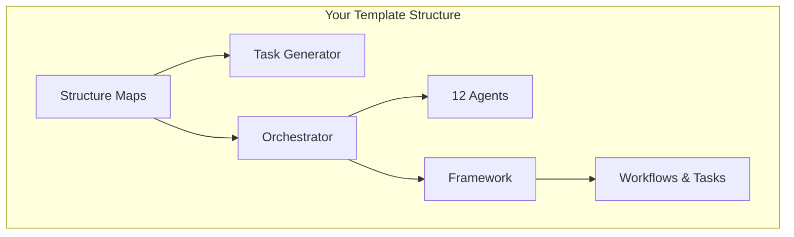

# 🗺️ Structure Maps Introduction - Navigate Your Growing Nexus System

## 🎯 Why Structure Maps Matter for Your Template

When you start with this Nexus template, you'll have a clean, organized system. But as you customize it for your project, it will grow:

- Add new agents for your domain
- Create custom workflows
- Define project-specific tasks  
- Build memory hierarchies
- Establish engineering rules

**The Challenge**: How do you keep track of everything as your system grows from 50 files to 500+ files?

**The Solution**: Structure Maps give you visual navigation and dependency analysis that scales with your system.

## 🚀 Immediate Benefits in This Template

### 1. **Understand What You Have**
Your fresh template includes:
- 1 structure blueprint (the map generator itself)
- 1 analysis task (ready to run)
- 12 AI agents (orchestrator, developer, architect, etc.)
- Multiple workflows and tasks
- Engineering rules and quality gates

Structure Maps show you how all these pieces connect.

### 2. **Safe Customization**
Before you modify any template component, Structure Maps tell you:
- What depends on this file?
- What will break if I change it?
- What else needs updating together?
- Are there any circular dependencies?

### 3. **Growth Management**
As your system grows, Structure Maps evolve with it:
- Auto-detect new components you add
- Map dependencies in your custom agents
- Track relationships in your workflows
- Visualize your memory hierarchies

## 📊 What You'll See Right Away

### Component Overview


### Navigation Tree
```
📁 Your Nexus Template
├── 🗺️ structure/ [Navigation & dependency analysis]
├── 🤖 operations/ [12 AI agents ready to use]  
├── ⚙️ framework/ [Tasks, workflows, templates]
├── 💼 workspace/ [Your active work area]
└── 📋 briefing/ [Project configuration]
```

## 🎯 Getting Started (5 Minutes)

### Step 1: Generate Your First Map
```bash
# In Claude Code
*task generate-structure-maps

# In Cursor  
# Type: "@orchestrator.md"
# Say: "run task generate-structure-maps"
```

### Step 2: Explore the Results
You'll get:
- **Visual diagram** showing component relationships
- **Navigation tree** for exploring files
- **Dependency report** identifying connections
- **Health check** flagging any issues

### Step 3: Use for Planning  
Before customizing your template:
1. Check the impact analysis
2. Understand the dependency chains  
3. Plan your changes with full awareness
4. Update coordinated components together

## 🔄 Template Evolution with Structure Maps

### Week 1: Fresh Template
- 50+ files, clear structure
- Maps show template organization
- Easy to understand and navigate

### Month 1: Early Customization  
- 100+ files, custom agents added
- Maps track your additions
- Show integration points with template

### Month 6: Mature System
- 300+ files, domain-specific system
- Maps prevent navigation chaos
- Impact analysis guides changes
- Dependency health checks prevent issues

### Year 1: Enterprise System
- 1000+ files, multiple repositories
- Maps essential for team coordination
- Visual guides for onboarding
- Change impact analysis critical

## 💡 Template-Specific Use Cases

### Adding Your First Custom Agent
**Before**: "I'll just copy an existing agent and modify it"
**With Maps**: 
1. View agent.blueprint dependencies
2. See what files agents reference
3. Understand handoff patterns
4. Plan integration with workflows
5. Generate map after creation to validate

### Creating Domain Workflows
**Before**: "I'll wing it and see what happens"  
**With Maps**:
1. Analyze existing workflow patterns
2. See agent coordination requirements
3. Understand quality gate integration
4. Plan memory context updates
5. Validate workflow dependencies

### Template Maintenance
**Before**: "Hope I don't break anything"
**With Maps**:
1. Run dependency health checks
2. Identify outdated references  
3. Plan coordinated updates
4. Validate system integrity
5. Document architectural decisions

## 🎯 Structure Maps vs Traditional Navigation

### Traditional File Explorer
- Lists files alphabetically
- No relationship context
- Change impact unknown
- Navigation by guesswork
- Dependency hunting manual

### Structure Maps
- Shows relationships visually
- Dependency context always visible  
- Impact analysis built-in
- Navigation by understanding
- Automated dependency tracking

## 🚀 Ready to Explore?

1. **Read the Full Guide**: Check `structure/README.md`
2. **Generate Your Map**: Run `*task generate-structure-maps`
3. **Explore the Blueprint**: Look at `structure/core/structure-map.blueprint.yaml`
4. **Start Customizing**: Use maps to guide your template modifications

Structure Maps transform your template from a collection of files into a navigable, understandable system architecture. They're your GPS for the Language-Based Operating System journey ahead!

---

**🔗 Quick Links**:
- Full Documentation: `structure/README.md`
- Map Blueprint: `structure/core/structure-map.blueprint.yaml`
- Generation Task: `framework/tasks/analysis/generate-structure-maps.md`
- Template Overview: `README.md`