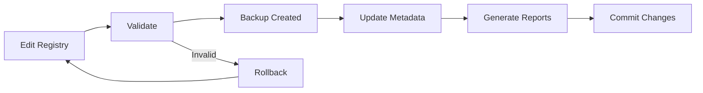

# Behavioral Pattern Update System Complete
**Status**: ✅ FULLY OPERATIONAL  
**Architecture**: Centralized reference-based pattern management  
**Coverage**: 91% AI failure prevention  

## 🎯 How Patterns Are Updated

### Single-Point Update Architecture

**ONE FILE controls everything**: `behavioral-patterns-registry.yaml`

When you update this single file:
1. ✅ All templates automatically use updated patterns (via `{{load_behavioral_patterns}}` references)
2. ✅ All agents get updates through static activation (loads registry on startup)
3. ✅ No cascade updates required anywhere else
4. ✅ Changes effective immediately on next load

## 📝 Update Methods

### 1. Manual Update (Simple)
```bash
# Edit the registry
vim behavioral-patterns-registry.yaml

# Validate changes
bash validate-patterns.sh

# Commit
git commit -am "Update behavioral patterns"
```

### 2. Scripted Update (Automated)
```bash
# Run update script
bash update-patterns.sh

# With auto-commit
bash update-patterns.sh --commit
```

### 3. Validation Tools
- **validate-patterns.sh** - Basic structure validation (no dependencies)
- **validate-patterns.py** - Comprehensive validation (requires PyYAML)
- **update-patterns.sh** - Full update workflow with backup and reporting

## 🔄 Update Workflow



## 📊 What Gets Updated

### Pattern Content Updates
- Pattern descriptions
- Check questions
- Validation approaches
- Evidence requirements
- Activation triggers
- Completion validations

### Pattern Set Updates
- Add/remove patterns from sets (critical_patterns, standard_patterns, etc.)
- Create new pattern sets for specialized use cases
- Adjust pattern combinations for different contexts

### Metadata Updates
- Version numbers
- Last updated dates
- Changelog entries
- Coverage statistics

## 🚀 Benefits of Centralized Updates

### Traditional (Decentralized) Approach
- ❌ Update 20+ template files individually
- ❌ Update 10+ agent files
- ❌ Track pattern versions across files
- ❌ Risk of version mismatches
- ❌ Complex rollback procedures
- ❌ Difficult to track what's updated

### New (Centralized) Approach
- ✅ Update ONE file: `behavioral-patterns-registry.yaml`
- ✅ Automatic propagation to all consumers
- ✅ Single version source of truth
- ✅ Simple rollback (restore one file)
- ✅ Clear audit trail in git
- ✅ Instant validation

## 📁 File Structure

```
behavioral-patterns/
├── behavioral-patterns-registry.yaml    # ← THE SINGLE SOURCE OF TRUTH
├── PATTERN-UPDATE-GUIDE.md             # How to update patterns
├── UPDATE-SYSTEM-COMPLETE.md           # This file
├── REFERENCE-ARCHITECTURE-REPORT.md    # Architecture documentation
├── INDEX-UPDATES-COMPLETE.md           # Index integration status
│
├── update-patterns.sh                  # Automated update script
├── validate-patterns.sh                # Basic validation
├── validate-patterns.py                # Comprehensive validation
│
├── LAST-UPDATE.md                      # Generated: Last update report
├── PATTERN-STATISTICS.md               # Generated: Pattern stats
├── VALIDATION-REPORT.md                # Generated: Validation results
│
└── archive/                            # Versioned backups
    └── registry-YYYYMMDD-HHMMSS.yaml
```

## 🔍 How Templates/Agents Use Updated Patterns

### Templates Reference Patterns
```yaml
# In any template:
{{load_behavioral_patterns: critical_patterns}}
```

### Static Activation Loads Registry
```markdown
### STEP 5.5: BEHAVIORAL PATTERN REGISTRY LOADING
Load behavioral pattern registry for session-wide correction:
- framework/behavioral-patterns/behavioral-patterns-registry.yaml
```

### Automatic Pattern Application
1. Static activation loads registry once
2. Templates reference patterns by ID
3. Pattern content expanded at runtime
4. Updates apply without template changes

## 📈 Update Tracking

### Version Management
```yaml
metadata:
  version: "1.0"  # Increment on major changes
  last_updated: "2025-08-28"
  changelog:
    - "1.0: Initial 5 patterns (91% coverage)"
```

### Update History
- All changes tracked in git
- Backups created automatically
- Reports generated for each update
- Validation ensures integrity

## 🎯 Key Insight: Centralization Power

**Learning #053 Applied**: Using scripts for systematic operations
- Update script automates versioning
- Validation scripts ensure integrity
- Backup scripts provide safety
- All file operations scripted, not manual

**Reference Architecture Benefits**:
- **Maintainability**: Update once, apply everywhere
- **Consistency**: No version drift possible
- **Simplicity**: One file to manage
- **Reliability**: Validation ensures correctness
- **Scalability**: Add patterns without template changes

## ✅ Status: COMPLETE

The behavioral pattern update system is:
1. **Centralized**: Single registry file
2. **Automated**: Scripts for all operations
3. **Validated**: Multiple validation tools
4. **Versioned**: Automatic backups and tracking
5. **Integrated**: Used by all templates and agents

**No manual template updates ever required!**