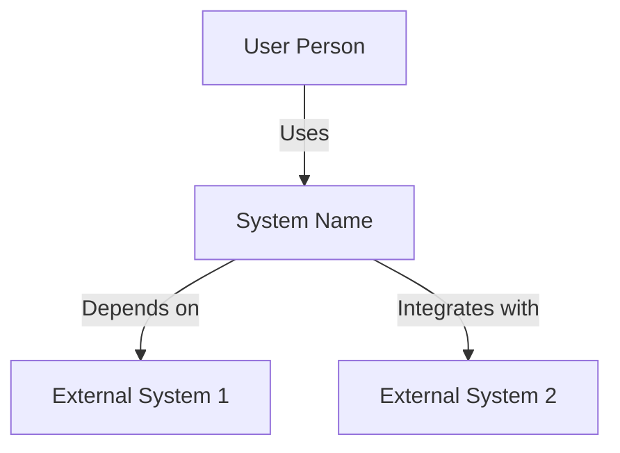
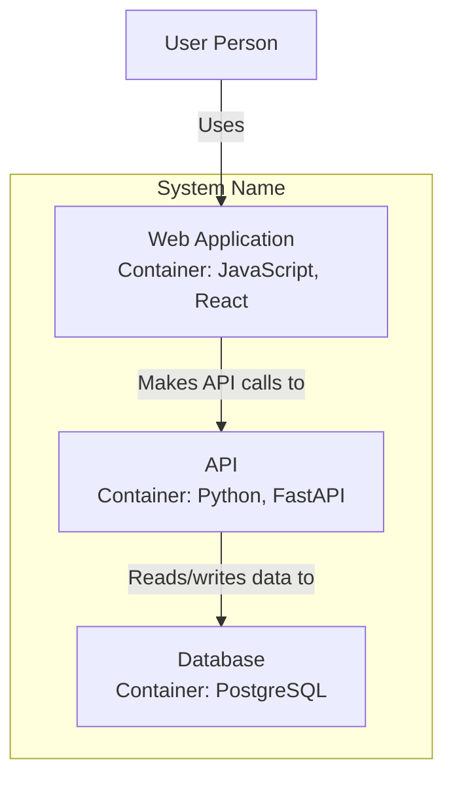

<!-- version: shard-20250825154349 -->
<!-- last-updated: 2025-08-25T15:43:49Z -->
<!-- document-type: engineering-rule-shard -->
<!-- parent-document: consolidated-rules -->

# Code & Architecture Documentation

## 📚 **COMPREHENSIVE DOCUMENTATION STANDARDS**

### **Code Documentation Requirements**

#### **File Headers**
Every source file must include:
```typescript
/**
 * @file filename.ext
 * @description Brief description of file's purpose and contents
 * @module module_name
 * @author Original Author <email> (optional)
 * @copyright Copyright (c) YYYY Organization
 * @license License information
 */
```

#### **Class Documentation**
```typescript
/**
 * @class ClassName
 * @description Detailed description of class's purpose and functionality
 * @implements Interface1, Interface2 (if applicable)
 * @extends ParentClass (if applicable)
 * @example
 * // Example usage of the class
 * const instance = new ClassName(param1, param2);
 * instance.method();
 */
```

#### **Function/Method Documentation**
```typescript
/**
 * Brief description of what the function does
 *
 * @param {Type} paramName - Description of the parameter
 * @param {Type} [optionalParam=defaultValue] - Description of optional parameter
 * @returns {ReturnType} Description of the return value
 * @throws {ErrorType} Description of when/why this error is thrown
 * @example
 * // Example usage
 * const result = functionName(param1, param2);
 */
```

### **C4 Model Architecture Documentation**

#### **Level 1: System Context Diagram**
**Purpose**: Show how system fits into the world around it

**Elements**:
- System in scope
- Users (people who use the system)
- External systems that interact

**Documentation Requirements**:
- Title: "System Context Diagram for [System Name]"
- Brief description of system's purpose
- Key users and their goals
- External system dependencies
- Data flows between entities

#### **Level 2: Container Diagram**
**Purpose**: Show high-level technical building blocks

**Elements**:
- Containers (web apps, mobile apps, databases, file systems)
- Relationships between containers
- External users and systems from context diagram

**Documentation Requirements**:
- Title: "Container Diagram for [System Name]"
- Description of each container's responsibility
- Technology choices for each container
- Communication protocols between containers
- Data stores and their purposes

#### **Level 3: Component Diagram**
**Purpose**: Zoom into individual containers to show components

**Elements**:
- Components within a container
- Relationships between components
- External dependencies

**Documentation Requirements**:
- Title: "Component Diagram for [Container Name]"
- Description of each component's responsibility
- Key interfaces and contracts
- Dependencies between components
- External services used

#### **Level 4: Code Diagram**
**Purpose**: Show implementation details (optional)

**Elements**:
- Classes, interfaces, and other code elements
- Relationships between code elements

**Documentation Requirements**:
- Title: "Code Diagram for [Component Name]"
- Key classes and their responsibilities
- Important methods and properties
- Inheritance and implementation relationships
- Design patterns used

### **Mermaid Diagram Standards**

#### **Critical Mermaid Rules**
1. **Never use quotes inside node names** - Can cause rendering issues
   - Incorrect: `Node["User's Profile"]`
   - Correct: `Node[User Profile]`
2. **Use descriptive node IDs** - Make node IDs meaningful
3. **Keep node text concise** - Avoid long text
4. **Use consistent styling** - Maintain visual consistency
5. **Add meaningful relationship labels** - Clearly describe relationships

#### **System Context Template**


#### **Container Diagram Template**


### **Documentation Maintenance**

#### **When to Update Documentation**
1. When creating new code or components
2. When modifying existing functionality
3. When refactoring code structure
4. When changing architectural decisions
5. When fixing bugs that reveal incorrect documentation

#### **Review Process**
1. Verify accuracy and completeness
2. Check for clarity and understandability
3. Ensure adherence to documentation standards
4. Validate diagrams against actual implementation

