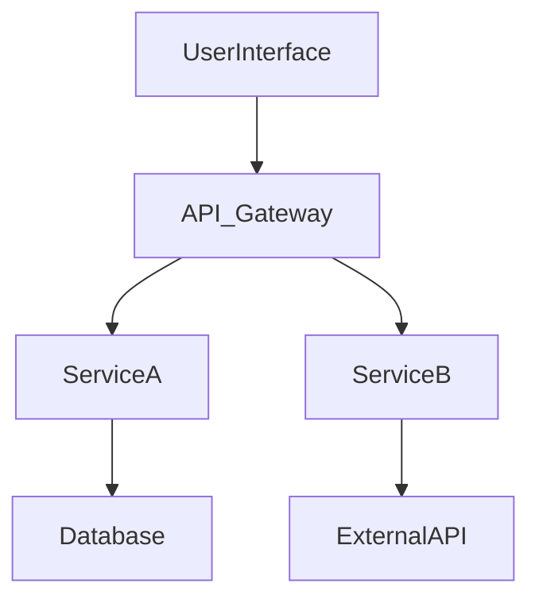

<!-- version: shard-20250825154349 -->
<!-- last-updated: 2025-08-25T15:43:49Z -->
<!-- document-type: engineering-rule-shard -->
<!-- parent-document: consolidated-rules -->

# PRD Writing Standards

## 📋 **PRD WRITING STANDARDS**

### **CRITICAL: PRD Format Must Be Strictly Followed**

**WARNING:** These guidelines must be strictly followed when generating PRDs based on given requirements or existing context. The aim is to produce PRDs that are thorough, technically sound, and exceptionally clear, enabling seamless understanding and execution by human engineers and product managers.

### **Mandatory PRD Structure**

## 1. Introduction & Overview

### 1.1. Purpose of this Document
- Briefly state the goal of this PRD: what feature, framework, or system is being defined?
- Who is the intended audience? (e.g., Engineering, Product, QA, UX)

### 1.2. Goals & Objectives
- What are the high-level business or user goals this PRD aims to achieve?
- What are the specific, measurable, achievable, relevant, and time-bound (SMART) objectives?
- How will success be measured? Define key metrics.

### 1.3. Scope
- Clearly define what is **in scope** for this PRD
- Explicitly state what is **out of scope** to avoid ambiguity

### 1.4. Definitions & Acronyms
- List any terms, acronyms, or abbreviations used throughout the document

## 2. Feature/Framework Requirements

### 2.1. User Stories / Use Cases
- Describe the target users/personas
- Detail specific user stories in the format: "As a [type of user], I want to [perform an action] so that [I can achieve a benefit]."
- For each user story, include acceptance criteria (how to verify it's done correctly)
- Detail specific use cases, including primary flows, alternative flows, and edge cases

### 2.2. Functional Requirements
- Enumerate all specific functionalities the system/feature must perform
- Be precise and unambiguous. Use "shall" or "must" for mandatory requirements
- Example: "The system shall allow users to reset their password via email."

### 2.3. Non-Functional Requirements (NFRs)
- **Performance**: e.g., response times, throughput, load capacity
- **Scalability**: e.g., ability to handle X concurrent users, Y data volume growth
- **Availability/Reliability**: e.g., uptime requirements (99.99%), Mean Time Between Failures (MTBF)
- **Security**: e.g., authentication, authorization, data encryption, compliance (GDPR, HIPAA)
- **Usability/Accessibility**: e.g., ease of use, WCAG compliance
- **Maintainability**: e.g., code quality standards, modularity, ease of updates
- **Portability**: e.g., browser compatibility, OS compatibility
- **Localization/Internationalization**: e.g., support for multiple languages, regions

## 3. Developer SDK / Framework Usage (If Applicable)

### 3.1. Target Audience for SDK/Framework
- Who are the primary developers that will use this SDK or framework?
- What is their expected level of expertise?

### 3.2. Desired Usage & Developer Experience (DX)
- Provide clear, concise code examples demonstrating intended use
- Illustrate the "happy path" and key extension points
- Define the public API surface: classes, methods, functions, parameters, return types
- Specify error handling mechanisms and expected exceptions
- Outline best practices for using the SDK/framework
- Describe desired developer experience: ease of setup, clarity of documentation

### 3.3. SDK/Framework Non-Functional Requirements
- **Performance Overhead**: Acceptable performance impact
- **Bundle Size/Footprint**: Size constraints for client-side SDKs
- **Dependencies**: External dependencies the SDK/framework will have
- **Versioning Strategy**: How the SDK/framework will be versioned (e.g., SemVer)
- **Deprecation Policy**: How breaking changes will be handled

## 4. Technical PRD (Technical Design & Implementation Details)

### 4.1. System Architecture Overview
- High-level diagram of the system/feature within existing architecture
- Briefly describe chosen architectural patterns (e.g., microservices, event-driven, layered)

### 4.2. Dependencies on Existing Modules/Systems
- List all existing internal modules, services, or libraries
- For each dependency:
  - Provide full path to module/code (e.g., `app/lib/modules/some_module`)
  - Specify key classes, functions, or types utilized
  - Describe nature of interaction
  - Note assumptions about behavior or API
  - Identify potential risks or limitations

### 4.3. System / Feature Components Breakdown
- Decompose system/feature into logical components/modules
- For each component:
  - **Responsibility**: Define purpose and function
  - **Interfaces**: Define public API (inputs, outputs, methods)
  - **Interactions**: Describe component interactions
  - **Data Models**: Specify data structures or models
  - **Key Algorithms/Logic**: Outline complex algorithms or business logic

**WARNING**: Every Feature spanning multiple repositories MUST have detailed breakdown per REPOSITORY

### 4.4. Mermaid Graph of Proposed Implementation
- Include detailed Mermaid diagrams:
  - **Component Diagram**: Major components and relationships
  - **Sequence Diagram(s)**: Key interactions or user flows
  - **Class Diagram(s)**: New or modified classes
  - **State Diagram(s)**: Complex state transitions
  - **Data Flow Diagram(s)**: How data moves through system

#### Example Structure:

### 4.5. Detailed Design Documentation
- **Data Models & Schema**: Database schemas, NoSQL structures, API payloads
- **API Design**: RESTful endpoints, GraphQL schemas, gRPC definitions
- **Error Handling & Resilience**: Error strategy, retry mechanisms, circuit breakers
- **Security Considerations**: Threat mitigation, data privacy measures
- **Scalability & Performance Design**: Caching strategies, async processing
- **Testing Strategy**: Unit, integration, E2E, performance, security tests
- **Deployment & Rollout Plan**: Deployment steps, migrations, rollback plan
- **Monitoring & Alerting**: Key metrics, alert conditions

### 4.6. Alternatives Considered & Justification
- Describe significant alternative design choices considered
- Provide clear justification for chosen design (trade-offs)

## 5. Open Questions & Future Considerations
- List unresolved questions or issues needing discussion
- Note potential future enhancements out of scope

## 6. Sign-off & Stakeholders
- List key stakeholders for review and approval
- (Optional) Section for sign-off signatures/dates

