# 🏗️ Nexus System Guide [HONEST VERSION]
*What You Actually Need to Know*

---

## ⚠️ Before You Start

### Prerequisites Check

```mermaid
flowchart TD
    Start[Want to use Nexus?] --> Check{Do you have?}
    Check --> Node[✅ Node.js 18+]
    Check --> Git[✅ Git installed]
    Check --> Space[✅ 500MB free space]
    Check --> Time[✅ 1-2 hours to learn]
    
    Node & Git & Space & Time --> Ready[You're Ready!]
    Check --> Missing[❌ Something Missing]
    Missing --> Install[Install Missing Items]
    Install --> Ready
    
    Ready --> Download[Download Template]
    
    style Check fill:#FFD700
    style Missing fill:#FF5252
    style Ready fill:#4CAF50
```


### Honest Expectations
- **First feature**: 30 minutes to 2 hours (not 5 minutes)
- **Learning curve**: 2-3 days to feel comfortable
- **Success rate**: ~70% complete first feature without help
- **Common issues**: Template detection, command spelling, unclear error messages

---

## 1. What Actually Happens (No BS)

### The Reality Timeline


### When Things Go Wrong


---

## 2. Commands That Actually Work

### Essential Commands (Test These First)
```mermaid
graph LR
    subgraph "Commands You'll Actually Use"
        Hi[hi<br/>Start system]
        Setup[1<br/>Quick setup (first time)]
        Plan[plan-feature<br/>Design something]
        Build[implement-feature<br/>Build from design]
        Help[help<br/>When stuck]
        Bye[bye<br/>Save and exit]
    end
    
    Hi --> Setup
    Setup --> Plan
    Plan --> Build
    Build --> Bye
    Help -.-> Hi
    Help -.-> Plan
    Help -.-> Build
    
    style Hi fill:#4CAF50
    style Help fill:#FFA726
    style Bye fill:#FF5252,color:#FFF
```

### Commands That Often Fail
| Command | Common Issue | Fix |
|---------|-------------|-----|
| `hi` | "Agent not found" | Check you're in right folder |
| `plan-feature` | Nothing happens | Template might not be detected |
| `implement-feature` | "No artifacts found" | Run plan-feature first |
| Any command | Typos | Double-check spelling |

---

## 3. The Agents (Simplified Truth)

### Who Does What
```mermaid
graph TB
    You[You] --> Orch[🎯 Orchestrator<br/>"The Router"]
    
    Orch --> Simple{Simple Task?}
    Simple -->|Yes| Direct[Handles Directly]
    Simple -->|No| Expert[Routes to Expert]
    
    Expert --> Dev[💻 Developer<br/>Builds code]
    Expert --> QA[🔍 QA<br/>Tests stuff]
    Expert --> Help[📚 Explainer<br/>Explains things]
    Expert --> Other[+ 8 Other Specialists<br/>For complex stuff]
    
    Direct --> Result[You Get Result]
    Dev --> Result
    QA --> Result
    Help --> Result
    Other --> Result
    
    style You fill:#E3F2FD
    style Orch fill:#FFD700,stroke:#333,stroke-width:3px
    style Result fill:#4CAF50
```

**Reality Check**: You mostly talk to the Orchestrator. Other agents work behind the scenes.

---

## 4. Feature Development (What Really Happens)

### The Two Phases (Honestly)
```mermaid
flowchart TB
    subgraph "Phase 1: Planning (10-30 mins)"
        Start[You: 'I want X'] --> Q1[System asks questions]
        Q1 --> You1[You answer<br/>(hopefully correctly)]
        You1 --> More{More questions?}
        More -->|Yes| Q2[System asks more]
        More -->|No| Files[5 files created]
        Q2 --> You2[You answer again]
        You2 --> More
    end
    
    subgraph "Phase 2: Building (5-15 mins)"
        Files --> Build[implement-feature]
        Build --> Magic[System builds stuff]
        Magic --> Check{Did it work?}
        Check -->|Yes| Success[Files appear]
        Check -->|No| Debug[Debug time]
        Debug --> Retry[Try again]
        Retry --> Check
    end
    
    Success --> Happy[You're happy!]
    
    style Start fill:#E3F2FD
    style Check fill:#FFD700
    style Debug fill:#FFA726
    style Happy fill:#4CAF50
```

### Common Planning Questions You'll Get
- **What type of feature?** (authentication, dashboard, form, etc.)
- **Who will use it?** (end users, admins, developers)
- **How complex?** (simple, medium, advanced)
- **Any special requirements?** (security, performance, integrations)

---

## 5. When Things Don't Work (The Real Guide)

### Most Common Issues


### The "Nuclear Option" (When All Else Fails)
1. Close everything
2. Delete the template folder
3. Download fresh template
4. Start over
5. This works 95% of the time

---

## 6. Quality System (What Actually Happens)

### The Quality Check Process

```mermaid
flowchart LR
    Feature[Feature Built] --> Auto[Automatic Checks]
    Auto --> Result{Result}
    
    Result -->|✅ Good| Pass[Feature ready]
    Result -->|⚠️ Issues| Warn[Has problems<br/>but usable]
    Result -->|❌ Broken| Fail[Needs fixing]
    
    Warn --> Decision{Your call}
    Decision -->|Use anyway| Accept[Accept warnings]
    Decision -->|Fix first| Fix[Improve feature]
    
    Fail --> MustFix[Must fix issues]
    Fix --> Auto
    MustFix --> Auto
    
    style Auto fill:#FFD700
    style Pass fill:#4CAF50
    style Warn fill:#FFA500
    style Fail fill:#FF5252
```


**Truth**: Most features pass with warnings. That's normal and usually fine.

---

## 7. Limitations (What It Can't Do)

### Current Limits

```mermaid
graph TB
    subgraph "❌ What Nexus CAN'T Do"
        No1[Complex multi-service architectures]
        No2[Real-time collaboration editing]
        No3[Visual drag-and-drop interfaces]
        No4[Direct database connections]
        No5[Production deployments]
        No6[Code debugging/runtime errors]
    end
    
    subgraph "✅ What Nexus DOES Well"
        Yes1[Single features/components]
        Yes2[Documentation generation]
        Yes3[Planning and design]
        Yes4[Code structure/boilerplate]
        Yes5[Development workflows]
        Yes6[Learning and prototyping]
    end
    
    style No1 fill:#FFCDD2
    style Yes1 fill:#C8E6C9
```


---

## 8. Success Tips (From Real Users)

### Things That Work
1. **Be specific**: "Add login form" not "authentication system"
2. **Start small**: Single features, not entire applications
3. **Always say 'bye'**: Saves your progress reliably
4. **Read the questions**: System asks good questions, answer them
5. **Check your folder**: Many issues are path-related

### Things That Don't Work
1. **Vague requests**: "Make it better" confuses the system
2. **Huge features**: "Build e-commerce site" is too big
3. **Skipping steps**: plan-feature before implement-feature
4. **Fighting errors**: When stuck, restart with 'bye' → 'hi'
5. **Expecting perfection**: First attempt is rarely perfect

---

## 9. Real Examples (What Actually Works)

### Good Feature Requests


### Project Size Guide
- **Perfect**: Single page, single component, single feature
- **Good**: Small multi-step workflow (login → dashboard)
- **Challenging**: Multiple related features
- **Too Big**: Entire applications or systems

---

## 10. Troubleshooting Guide

### Step-by-Step Recovery


### Emergency Contacts
- If nothing works: Check the GitHub issues
- If template is broken: Re-download from source
- If you're lost: Start with simple examples

---

## Bottom Line Truth

**Nexus is powerful but has a learning curve.** 

- First day: Frustrating but exciting
- First week: Starting to click
- First month: Actually productive

**Most people succeed if they:**
1. Follow the setup exactly
2. Start with simple features
3. Don't skip the planning phase
4. Ask for help when stuck
5. Remember to save progress with 'bye'

**You'll know it's working when:**
- Commands respond quickly
- Features generate successfully
- You stop fighting the system
- You start thinking in "features"

---

*This is the honest truth about Nexus. It's worth learning, but be patient with yourself and the system.*