# 🏗️ Nexus System Architecture Diagrams [TEMPLATE EDITION]
*Visual Guide to Your Language-Based Operating System*

---

## 🚀 Your 60-Second Journey to Productivity

```mermaid
flowchart LR
    S[📁 Get Template] -->|10s| C[Add Your Docs]
    C -->|20s| H[Say 'hi']
    H -->|20s| Q[Press '1']
    Q -->|10s| A[Answer 4 Questions]
    A -->|10s| R[🎉 Ready to Build!]
    
    style S fill:#4CAF50
    style H fill:#2196F3
    style Q fill:#FFD700
    style R fill:#9C27B0
```



---

## 1. How It Works - The Revolutionary Paradigm

### Traditional vs Nexus Development

```mermaid
graph TB
    subgraph "❌ OLD WAY"
        O1[Learn Syntax] --> O2[Write Code]
        O2 --> O3[Debug Errors]
        O3 --> O4[Deploy]
    end
    
    subgraph "✅ NEXUS WAY"
        N1[Speak Intent] --> N2[System Builds]
        N2 --> N3[Auto-Validates]
        N3 --> N4[Done!]
    end
    
    subgraph "🎯 RESULTS"
        R1[10x Faster]
        R2[Zero Syntax]
        R3[Self-Documenting]
    end
    
    O4 -.->|"Paradigm Shift"| N1
    N4 --> R1 & R2 & R3
    
    style O1 fill:#FFCDD2
    style N1 fill:#C8E6C9
    style R1 fill:#FFD700
```


### The Core Magic


---

## 2. Your First Feature - What Actually Happens

### The Two-Phase Development Flow

```mermaid
flowchart TB
    subgraph "📝 PHASE 1: PLANNING [5 mins]"
        U["You: 'I want user authentication'"] --> P[plan-feature]
        P --> Q1["Q: What kind of auth?"]
        Q1 --> A1["A: Email/password"]
        Q1 --> Q2["Q: Security needs?"]
        Q2 --> A2["A: Standard JWT"]
        A2 --> ART[📦 5 Planning Artifacts]
    end
    
    subgraph "🔨 PHASE 2: BUILDING [2 mins]"
        ART --> I[implement-feature]
        I --> AUTO[Automatic Creation]
        AUTO --> F1[✅ PRD.md]
        AUTO --> F2[✅ Code Files]
        AUTO --> F3[✅ Tests]
        AUTO --> F4[✅ Documentation]
    end
    
    subgraph "🎉 RESULT"
        F1 & F2 & F3 & F4 --> DONE[Working Feature!]
    end
    
    style U fill:#E3F2FD
    style P fill:#FFD700
    style DONE fill:#4CAF50
```


---

## 3. The Agents - Your AI Development Team

### Simple Agent Hierarchy
```mermaid
graph TB
    subgraph "🤖 YOUR AI TEAM"
        O[🎯 Orchestrator<br/>Your Main Guide]
        
        O --> HELP[📚 Explainer<br/>When You Need Help]
        O --> BUILD[💻 Developer<br/>When You Build]
        O --> CHECK[🔍 QA<br/>When You Test]
        
        subgraph "Advanced Team"
            MORE[🏗️ Architect | 📊 Product Manager | 🎨 UX Expert<br/>+ 6 More Specialists]
        end
    end
    
    style O fill:#FFD700,stroke:#333,stroke-width:3px
    style HELP fill:#E3F2FD
    style BUILD fill:#C8E6C9
    style CHECK fill:#FFEBEE
```

### How They Work Together


---

## 4. Session Flow - How Conversations Work

### Your Typical Session


### The Critical Commands

```mermaid
graph LR
    subgraph "🎮 ESSENTIAL COMMANDS"
        START[hi - Start]
        PLAN[plan-feature - Design]
        BUILD[implement-feature - Create]
        END[bye - Save & Exit]
    end
    
    START -->|Initialize| PLAN
    PLAN -->|Design Done| BUILD
    BUILD -->|Work Complete| END
    
    style START fill:#4CAF50
    style PLAN fill:#2196F3
    style BUILD fill:#FFD700
    style END fill:#FF5722,color:#FFF
```


---

## 5. Quality System - Automatic Excellence

### ULTRATHINK Validation

```mermaid
flowchart TD
    subgraph "🔍 AUTOMATIC QUALITY CHECKS"
        T[Your Feature] --> Q[5 Brutal Questions]
        
        Q --> Q1[Does it WORK?]
        Q --> Q2[Can we PROVE it?]
        Q --> Q3[What could BREAK?]
        Q --> Q4[Is it COMPLETE?]
        Q --> Q5[Is it REAL?]
        
        Q1 & Q2 & Q3 & Q4 & Q5 --> E[Evidence Check]
        
        E --> PASS[✅ PASS]
        E --> WARN[⚠️ CONCERNS]
        E --> FAIL[❌ NEEDS WORK]
    end
    
    style T fill:#E3F2FD
    style Q fill:#FFD700
    style PASS fill:#4CAF50
    style WARN fill:#FFA500
    style FAIL fill:#F44336
```


---

## 6. Template Personalization Flow

### Making It Yours

```mermaid
flowchart TB
    subgraph "🎨 PERSONALIZATION JOURNEY"
        T[Template] --> Q[Quick Setup]
        
        Q --> Q1["What are you building?"]
        Q1 --> A1[Your Project Type]
        
        Q --> Q2["Your expertise level?"]
        Q2 --> A2[Adjusts Explanations]
        
        Q --> Q3["Preferred style?"]
        Q3 --> A3[Formal/Casual]
        
        Q --> Q4["Team or solo?"]
        Q4 --> A4[Collaboration Mode]
        
        A1 & A2 & A3 & A4 --> P[Personalized System]
    end
    
    P --> R[🎯 YOUR Nexus System]
    
    style T fill:#F0F0F0
    style Q fill:#FFD700
    style R fill:#9C27B0
```


---

## 7. What Makes Nexus Different

### The Paradigm Shift

```mermaid
graph TB
    subgraph "🚀 NEXUS INNOVATIONS"
        I1[💬 Natural Language Only<br/>No syntax to learn]
        I2[🧠 Self-Evolving<br/>Gets smarter with use]
        I3[📝 Self-Documenting<br/>Always up-to-date]
        I4[✅ Self-Validating<br/>Quality built-in]
        I5[🔄 Context Persistent<br/>Never lose work]
    end
    
    subgraph "= RESULT"
        R[🎯 10x Productivity<br/>Focus on WHAT, not HOW]
    end
    
    I1 & I2 & I3 & I4 & I5 --> R
    
    style I1 fill:#E3F2FD
    style I2 fill:#F3E5F5
    style I3 fill:#FFF8E1
    style I4 fill:#E8F5E9
    style I5 fill:#FFEBEE
    style R fill:#FFD700
```


---

## 8. Common User Journeys

### Your First Day


---

## Quick Reference Card

### 🎮 Command Cheat Sheet
| Command | What It Does | When To Use |
|---------|--------------|-------------|
| `hi` | Start Nexus | Beginning of session |
| `1` | Quick Setup | First time only |
| `plan-feature` | Design new feature | Starting something new |
| `implement-feature` | Build from plan | After planning |
| `help` | Get assistance | Anytime |
| `bye` | Save & exit | End of session |

### 📊 System Stats (Fresh Template)
- **Setup Time**: 60 seconds
- **First Feature**: 5-7 minutes
- **Learning Curve**: Zero
- **Syntax Required**: None
- **Documentation**: Automatic

### 🚀 Success Tips
1. **Always say 'bye'** - Saves your progress
2. **Use natural language** - Just explain what you want
3. **Trust the system** - It knows what it's doing
4. **Ask for help** - The Explainer agent loves questions

---

## Advanced Diagrams (Optional)

<details>
<summary>Click for Technical Architecture Details</summary>

### Full System Architecture


### Memory System


</details>

---

*Welcome to Nexus - Where natural language IS the programming language!*