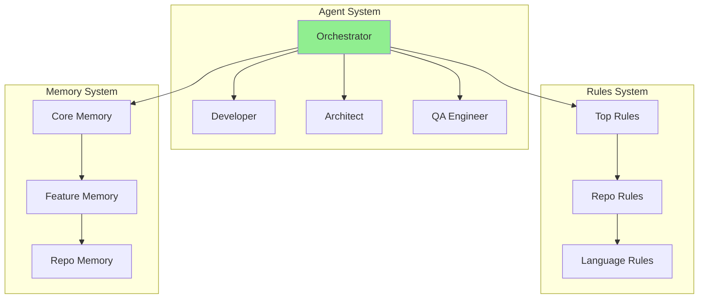

# Generate Structure Maps Task

**Category**: analysis
**Complexity**: medium
**Prerequisites**: Access to structure blueprints and system files

## Purpose
Generate visual maps and dependency analysis for the Nexus system, making complex architecture navigable and understandable.

## Execution Steps

### Step 1: Scan System Structure
```bash
# Scan all blueprint files
find structure/ -name "*.blueprint.yaml" -type f

# Count total components
echo "Agents: $(find operations/agents -name "*.md" | wc -l)"
echo "Workflows: $(find framework/workflows -name "*.md" | wc -l)"
echo "Tasks: $(find framework/tasks -name "*.md" | wc -l)"
```

### Step 2: Extract Dependencies
Analyze each blueprint for:
- `dependencies:` fields
- Path references (`.memory/`, `.engineeringrules/`, etc.)
- Agent handoff patterns
- Workflow step sequences

### Step 3: Build Dependency Graph
Create adjacency list of all dependencies:
```yaml
component_dependencies:
  agent.blueprint:
    depends_on: ["context-map.md", "memory-rules.md"]
    references: ["workflows", "tasks", "checklists"]
    generates: [".claude/agents/*.md"]
  
  orchestrator:
    coordinates: ["all-agents"]
    uses: ["workflows", "tasks"]
    updates: ["memory"]
```

### Step 4: Generate Visualizations

#### Component Dependency Map (Mermaid)


#### ASCII Navigation Tree
```
📁 Nexus Structure Map
├── 🏗️ Blueprints (10 core definitions)
│   ├── agent.blueprint.yaml → Creates agents
│   ├── workflow.blueprint.yaml → Orchestrates multi-agent flows
│   └── task.blueprint.yaml → Defines executable tasks
├── 🤖 Agents (17 total)
│   └── Orchestrator (hub) → All other agents
├── 📚 Memory (Hierarchical)
│   └── Core → Features → Repository
└── 📋 Rules (Inheritance chain)
    └── Top-level → Repo-specific → Language-specific
```

### Step 5: Detect Issues

#### Circular Dependencies
- Check for A→B→C→A patterns
- Flag and report for resolution

#### Missing Dependencies  
- Verify all referenced files exist
- Report broken references

#### Cross-Repository Dependencies
- Identify integration points
- Document coordination requirements

## Output Artifacts

1. **dependency-graph.json** - Complete dependency data
2. **component-map.mmd** - Mermaid visualization
3. **navigation-tree.txt** - ASCII navigation aid
4. **issues-report.md** - Circular/missing dependencies

## Quality Validation
- [ ] All blueprints scanned
- [ ] Dependencies extracted accurately  
- [ ] Visualizations generated
- [ ] Issues detected and reported
- [ ] Navigation aids created

## Integration Points
- Feeds into structure-navigator agent
- Updates .memory/structure-maps/
- Used by architecture reviews
- Referenced in onboarding