# Documentation Workflow Diagrams
**Purpose**: Visual representations of documentation workflow for learning and explanation  
**Audience**: Developers, Documentation Teams, New Nexus Users  
**Last Updated**: 2025-08-29T17:30:00Z

## 🚀 User Guide System Architecture

```mermaid
graph TD
    subgraph "User Guide Ecosystem"
        subgraph "Entry Layer"
            A[README.md<br/>🚀 Quick Start<br/>278 lines]
            A1[2-min setup]
            A2[Success stories] 
            A3[Marketing positioning]
            A --> A1
            A --> A2
            A --> A3
        end
        
        subgraph "Learning Layer"
            B[beginner-guide.md<br/>📚 Educational<br/>685 lines]
            B1[Week-by-week progression]
            B2[Common mistakes]
            B3[Detailed examples]
            B --> B1
            B --> B2
            B --> B3
        end
        
        subgraph "Reference Layer"
            C[COMPREHENSIVE-USER-GUIDE.md<br/>🎯 Master Manual<br/>776 lines]
            C1[ULTRATHINK methodology]
            C2[12 critical pitfalls]
            C3[Behavioral corrections]
            C --> C1
            C --> C2
            C --> C3
        end
        
        subgraph "Visual Layer"
            D[diagrams.md<br/>📊 Visual Learning<br/>461 lines]
            D1[Mermaid workflows]
            D2[Architecture diagrams]
            D3[Process flows]
            D --> D1
            D --> D2
            D --> D3
        end
        
        A1 -.->|leads to| B1
        B2 -.->|detailed in| C2
        B3 -.->|visualized in| D1
        C1 -.->|shown in| D2
        
        subgraph "Nexus System Integration"
            E[User Activation]
            F[Feature Development]
            G[Close-Chat Protocol]
            H[System Learning]
        end
        
        A3 --> E
        B1 --> F
        C3 --> G
        D3 --> H
        
        style A fill:#e3f2fd
        style B fill:#f3e5f5
        style C fill:#fff8e1
        style D fill:#e8f5e8
        style E fill:#ffebee
        style F fill:#f1f8e9
        style G fill:#fce4ec
        style H fill:#e0f2f1
    end
```

## 💬 User Guide Integration Flow

## 🔄 User Learning Journey

```mermaid
sequenceDiagram
    participant U as User
    participant R as README.md
    participant B as beginner-guide.md
    participant C as COMPREHENSIVE-USER-GUIDE.md
    participant S as System
    
    U->>R: Quick start needed
    R->>U: "git clone → hi" (2 minutes)
    U->>S: First interaction
    S->>B: "For learning path, see beginner-guide"
    B->>U: Week 1-3 structured progression
    U->>C: Need advanced patterns
    C->>U: ULTRATHINK + 12 pitfalls + behavioral corrections
```

## 🎯 Workflow Overview Diagram

```mermaid
graph TB
    Start([🚀 Start Documentation Update])
    Start --> Phase1[📋 Phase 1: Discovery & Assessment<br/>1-4 hours]
    
    Phase1 --> |Analyst| P1Tasks[System Analysis<br/>Documentation Inventory<br/>Stakeholder Requirements]
    
    P1Tasks --> Phase2[🏗️ Phase 2: Planning & Architecture<br/>2-4 hours]
    
    Phase2 --> |Architect| P2Tasks[Documentation Architecture Design<br/>Implementation Plan<br/>Quality Gate Definitions]
    
    P2Tasks --> Phase3[📚 Phase 3: Foundation Documentation<br/>4-8 hours]
    
    Phase3 --> |Architect| P3Tasks[System Overview<br/>Architecture Docs<br/>Project Documentation]
    
    P3Tasks --> Phase4[🔌 Phase 4: API Documentation<br/>6-12 hours]
    
    Phase4 --> |Developer| P4Tasks[API Reference<br/>Usage Guides<br/>Code Examples]
    
    P4Tasks --> Phase5[🧩 Phase 5: Component Documentation<br/>8-16 hours]
    
    Phase5 --> |Developer| P5Tasks[Component Guides<br/>Configuration Docs<br/>Troubleshooting]
    
    P5Tasks --> Phase6[👥 Phase 6: User Documentation<br/>4-8 hours]
    
    Phase6 --> |Analyst| P6Tasks[Installation Guides<br/>User Tutorials<br/>Admin Docs]
    
    P6Tasks --> Phase7[✅ Phase 7: Integration & Validation<br/>2-4 hours]
    
    Phase7 --> |Orchestrator| P7Tasks[Documentation Integration<br/>Quality Assessment<br/>Publication]
    
    P7Tasks --> Complete([🎉 Documentation Complete])
    
    style Start fill:#4CAF50,stroke:#333,stroke-width:3px,color:#fff
    style Complete fill:#2196F3,stroke:#333,stroke-width:3px,color:#fff
    style Phase1 fill:#FFC107,stroke:#333,stroke-width:2px
    style Phase2 fill:#FF9800,stroke:#333,stroke-width:2px
    style Phase3 fill:#795548,stroke:#333,stroke-width:2px,color:#fff
    style Phase4 fill:#9C27B0,stroke:#333,stroke-width:2px,color:#fff
    style Phase5 fill:#673AB7,stroke:#333,stroke-width:2px,color:#fff
    style Phase6 fill:#3F51B5,stroke:#333,stroke-width:2px,color:#fff
    style Phase7 fill:#00BCD4,stroke:#333,stroke-width:2px
```

## 🤝 Agent Collaboration Flow

```mermaid
sequenceDiagram
    participant O as 🎯 Orchestrator
    participant An as 📊 Analyst
    participant Ar as 🏗️ Architect
    participant D as 💻 Developer
    
    Note over O: Workflow Initiation
    O->>An: Launch Discovery Phase
    activate An
    An-->>An: System Analysis
    An-->>An: Documentation Inventory
    An-->>An: Stakeholder Requirements
    An->>O: Discovery Complete
    deactivate An
    
    O->>Ar: Launch Planning Phase
    activate Ar
    Ar-->>Ar: Design Architecture
    Ar-->>Ar: Create Implementation Plan
    Ar->>O: Planning Complete
    deactivate Ar
    
    O->>Ar: Launch Foundation Phase
    activate Ar
    Ar-->>Ar: System Overview
    Ar-->>Ar: Architecture Docs
    Ar->>O: Foundation Complete
    deactivate Ar
    
    O->>D: Launch API Documentation
    activate D
    D-->>D: API Reference
    D-->>D: Usage Examples
    D->>O: API Docs Complete
    deactivate D
    
    O->>D: Launch Component Documentation
    activate D
    D-->>D: Component Guides
    D-->>D: Configuration Docs
    D->>O: Components Complete
    deactivate D
    
    O->>An: Launch User Documentation
    activate An
    An-->>An: User Guides
    An-->>An: Tutorials
    An->>O: User Docs Complete
    deactivate An
    
    O->>O: Final Integration & Validation
    Note over O: Documentation Published
```

## 📊 Quality Gates Progression

```mermaid
graph LR
    subgraph "Phase 1: Discovery"
        QG1[Quality Gate 1<br/>Assessment Complete]
    end
    
    subgraph "Phase 2: Planning"
        QG2[Quality Gate 2<br/>Architecture Approved]
    end
    
    subgraph "Phase 3: Foundation"
        QG3[Quality Gate 3<br/>Core Docs Complete]
    end
    
    subgraph "Phase 4: API"
        QG4[Quality Gate 4<br/>APIs Documented]
    end
    
    subgraph "Phase 5: Components"
        QG5[Quality Gate 5<br/>Components Complete]
    end
    
    subgraph "Phase 6: Users"
        QG6[Quality Gate 6<br/>User Guides Ready]
    end
    
    subgraph "Phase 7: Integration"
        QG7[Quality Gate 7<br/>Final Validation]
    end
    
    QG1 -->|PASS| QG2
    QG2 -->|PASS| QG3
    QG3 -->|PASS| QG4
    QG4 -->|PASS| QG5
    QG5 -->|PASS| QG6
    QG6 -->|PASS| QG7
    QG7 -->|PASS| Pub[📚 Publication]
    
    QG1 -.->|FAIL| Rework1[Rework]
    QG2 -.->|FAIL| Rework2[Rework]
    QG3 -.->|FAIL| Rework3[Rework]
    QG4 -.->|FAIL| Rework4[Rework]
    QG5 -.->|FAIL| Rework5[Rework]
    QG6 -.->|FAIL| Rework6[Rework]
    QG7 -.->|FAIL| Rework7[Rework]
    
    style QG1 fill:#4CAF50,stroke:#333,stroke-width:2px,color:#fff
    style QG2 fill:#4CAF50,stroke:#333,stroke-width:2px,color:#fff
    style QG3 fill:#4CAF50,stroke:#333,stroke-width:2px,color:#fff
    style QG4 fill:#4CAF50,stroke:#333,stroke-width:2px,color:#fff
    style QG5 fill:#4CAF50,stroke:#333,stroke-width:2px,color:#fff
    style QG6 fill:#4CAF50,stroke:#333,stroke-width:2px,color:#fff
    style QG7 fill:#4CAF50,stroke:#333,stroke-width:2px,color:#fff
    style Pub fill:#2196F3,stroke:#333,stroke-width:3px,color:#fff
```

## 🏗️ Documentation Architecture Structure

```mermaid
graph TD
    Root[📁 docs/]
    
    Root --> README[📄 README.md]
    Root --> CHANGELOG[📄 CHANGELOG.md]
    Root --> CONTRIBUTING[📄 CONTRIBUTING.md]
    
    Root --> Architecture[📁 architecture/]
    Architecture --> SysOverview[📄 system-overview.md]
    Architecture --> CompArch[📄 component-architecture.md]
    Architecture --> DataArch[📄 data-architecture.md]
    Architecture --> SecArch[📄 security-architecture.md]
    Architecture --> DeployArch[📄 deployment-architecture.md]
    
    Root --> API[📁 api/]
    API --> APIRef[📄 api-reference.md]
    API --> Auth[📄 authentication.md]
    API --> Webhooks[📄 webhooks.md]
    API --> Examples[📁 examples/]
    
    Root --> Components[📁 components/]
    Components --> CompA[📁 component-a/]
    CompA --> CompAReadme[📄 README.md]
    CompA --> CompAConfig[📄 configuration.md]
    CompA --> CompATrouble[📄 troubleshooting.md]
    
    Root --> Guides[📁 guides/]
    Guides --> GetStart[📄 getting-started.md]
    Guides --> Install[📄 installation.md]
    Guides --> Config[📄 configuration.md]
    Guides --> Deploy[📄 deployment.md]
    Guides --> Monitor[📄 monitoring.md]
    
    Root --> Tutorials[📁 tutorials/]
    Root --> Reference[📁 reference/]
    Root --> Assets[📁 assets/]
    
    style Root fill:#FFC107,stroke:#333,stroke-width:3px
    style Architecture fill:#FF9800,stroke:#333,stroke-width:2px
    style API fill:#9C27B0,stroke:#333,stroke-width:2px,color:#fff
    style Components fill:#673AB7,stroke:#333,stroke-width:2px,color:#fff
    style Guides fill:#3F51B5,stroke:#333,stroke-width:2px,color:#fff
```

## ⏱️ Time Investment Breakdown

## 🔄 Documentation Update Decision Tree

## 📈 Documentation Maturity Model

## 🎯 Quality Assessment Matrix

```mermaid
graph LR
    subgraph "Quality Dimensions"
        Accuracy[📊 Accuracy<br/>Technical correctness]
        Complete[✅ Completeness<br/>Coverage of topics]
        Clarity[💡 Clarity<br/>Easy to understand]
        Currency[🔄 Currency<br/>Up-to-date info]
        Usability[👥 Usability<br/>Easy to navigate]
    end
    
    subgraph "Quality Levels"
        Pass[✅ PASS<br/>90-100%]
        Concerns[⚠️ CONCERNS<br/>70-89%]
        Fail[❌ FAIL<br/><70%]
    end
    
    Accuracy --> Pass
    Complete --> Pass
    Clarity --> Concerns
    Currency --> Pass
    Usability --> Pass
    
    style Pass fill:#4CAF50,stroke:#333,stroke-width:2px,color:#fff
    style Concerns fill:#FFC107,stroke:#333,stroke-width:2px
    style Fail fill:#F44336,stroke:#333,stroke-width:2px,color:#fff
```

## 🚀 Quick Start Flow for Beginners

```mermaid
graph TD
    Start[🌟 New User Starts]
    
    Start --> Learn[🎓 Learn Platform<br/>Understand documentation workflow]
    Learn --> Trigger[📢 Trigger: Need docs]
    Trigger --> Command[💬 Say: I need to document my system]
    
    Command --> Orchestrator[🎯 Orchestrator responds:<br/>'Should I launch full documentation workflow?']
    
    Orchestrator --> Confirm[✅ User confirms]
    Confirm --> Launch[🚀 Workflow launches]
    
    Launch --> Phase1[📋 Phase 1 begins<br/>Analyst analyzes system]
    Phase1 --> Guide[📖 Guided through each phase]
    Guide --> Complete[🎉 Documentation complete!]
    
    style Start fill:#4CAF50,stroke:#333,stroke-width:3px,color:#fff
    style Learn fill:#2196F3,stroke:#333,stroke-width:2px,color:#fff
    style Complete fill:#9C27B0,stroke:#333,stroke-width:3px,color:#fff
```

## 📊 Documentation Coverage Heatmap

## 🔗 Workflow Integration Points

```mermaid
graph TB
    DocWorkflow[📚 Documentation Workflow]
    
    DocWorkflow --> Features[Feature Development]
    DocWorkflow --> Testing[Testing Workflows]
    DocWorkflow --> Deployment[Deployment Process]
    DocWorkflow --> Maintenance[System Maintenance]
    
    Features --> |Updates trigger| DocWorkflow
    Testing --> |Results feed| DocWorkflow
    Deployment --> |Changes require| DocWorkflow
    Maintenance --> |Improvements need| DocWorkflow
    
    subgraph "Nexus System Integration"
        Memory[Memory System]
        Patterns[Pattern Extraction]
        Quality[Quality Gates]
        Agents[Agent Collaboration]
    end
    
    DocWorkflow -.-> Memory
    DocWorkflow -.-> Patterns
    DocWorkflow -.-> Quality
    DocWorkflow -.-> Agents
    
    style DocWorkflow fill:#2196F3,stroke:#333,stroke-width:3px,color:#fff
    style Features fill:#9C27B0,stroke:#333,stroke-width:2px,color:#fff
    style Testing fill:#FF9800,stroke:#333,stroke-width:2px
    style Deployment fill:#4CAF50,stroke:#333,stroke-width:2px,color:#fff
    style Maintenance fill:#FFC107,stroke:#333,stroke-width:2px
```

---

## 📚 Usage in Learning Sessions

### For Beginners (Learning Platform Phase 1)
Show the **Quick Start Flow** and **Workflow Overview** diagrams to understand:
- How documentation workflows are triggered
- The phases involved in documentation
- Which agents handle which parts

### For Intermediate Users (Learning Platform Phase 2)
Use the **Agent Collaboration Flow** and **Quality Gates** diagrams to learn:
- How agents work together seamlessly
- The importance of quality validation
- How to navigate the workflow

### For Advanced Users (Learning Platform Phase 3)
Reference the **Documentation Architecture** and **Coverage Heatmap** to understand:
- How to structure comprehensive documentation
- How to assess documentation completeness
- Integration with other Nexus workflows

### For System Builders (Learning Platform Phase 4)
Study the **Maturity Model** and **Integration Points** to grasp:
- How documentation evolves with the system
- How documentation fits into the larger Nexus ecosystem
- Pattern extraction and reuse opportunities

---

## 🎨 Visual Design Guidelines

### Color Palette
- **Green** (#4CAF50): Success, completion, passing grades
- **Blue** (#2196F3): Primary actions, key components
- **Purple** (#9C27B0): API and technical elements
- **Orange** (#FF9800): Planning and architecture
- **Yellow** (#FFC107): Warnings, attention needed
- **Red** (#F44336): Failures, critical issues

### Diagram Best Practices
1. **Keep it Simple**: Each diagram focuses on one concept
2. **Use Consistent Colors**: Same meaning across all diagrams
3. **Progressive Disclosure**: Start simple, add complexity
4. **Interactive Elements**: Clickable in documentation tools
5. **Mobile Friendly**: Readable on all screen sizes

---

**These diagrams are designed to make the documentation workflow approachable and understandable for all skill levels!** 🚀