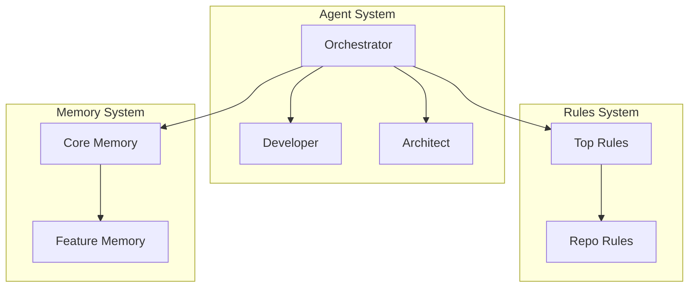

# 🗺️ Structure Maps - Navigate Your Nexus System

**What is this?** Structure Maps are visual navigation tools that transform your complex Nexus system into understandable, navigable diagrams and dependency analysis.

## 🎯 Purpose

Your Nexus system can grow to contain hundreds of files across agents, workflows, tasks, and blueprints. Structure Maps solve three critical problems:

1. **🧭 Navigation**: "How do I find what I need in this complex system?"
2. **🔗 Dependencies**: "What files depend on each other and how?"  
3. **📊 Impact Analysis**: "If I change this file, what else needs updating?"

## 🏗️ What Gets Mapped

Structure Maps analyze and visualize:

- **Blueprints**: Templates that define how system components are built
- **Agents**: Specialized AI personalities with specific roles
- **Workflows**: Multi-step processes coordinating multiple agents
- **Tasks**: Executable workflows with engineering rules integration
- **Memory System**: Context and state management across the system
- **Engineering Rules**: Quality standards and compliance requirements
- **Dependencies**: How all these components reference and depend on each other

## 📊 Types of Maps Generated

### 1. Component Dependency Map
Visual diagram showing how major system components connect:


### 2. Navigation Map
Interactive file tree showing structure and relationships:
```
📁 Your Nexus System
├── 🏗️ Structure [blueprints that define everything]
├── 🤖 Agents [AI personalities]
├── 🔄 Workflows [multi-step processes]
├── 📋 Tasks [executable workflows]
└── 💾 Memory [context and state]
```

### 3. Blueprint Relationship Map
Shows how blueprints depend on and generate other components:
```
agent.blueprint.yaml
├── Depends On: context-map.md, memory-rules.md
├── References: workflows, tasks, checklists
└── Generates: .claude/agents/*.md files
```

### 4. Impact Analysis Map
Visualizes what changes when you modify a component:
```
If you modify agent.blueprint.yaml:
→ Affects: All agent definitions
→ Updates needed: Agent templates
→ Quality gates: Agent validation
→ Coordination required: Workflow updates
```

## 🚀 How to Use Structure Maps

### Generate Your First Map
```bash
# Run the structure analysis task
*task generate-structure-maps

# This creates:
# - dependency-graph.json (raw data)
# - component-map.mmd (mermaid diagram)  
# - navigation-tree.txt (ASCII navigation)
# - issues-report.md (problems found)
```

### Common Use Cases

**🎯 Understanding Your System**
- New to the system? Start with the component dependency map
- Need to understand relationships? Check the blueprint relationship map
- Want to navigate efficiently? Use the interactive navigation map

**🔍 Before Making Changes**  
- Run impact analysis to see what your changes will affect
- Check for circular dependencies that might cause issues
- Identify all files that need coordinated updates

**🧭 Finding Related Components**
- "Show me everything that depends on this agent"
- "What workflows use this task?"
- "Where are the quality gates for this process?"

**📊 System Health Checks**
- Detect circular dependencies 
- Find missing file references
- Validate blueprint compatibility
- Ensure proper dependency chains

## 🏗️ Template Integration

This template comes with Structure Maps pre-configured:

### Ready-to-Use Components

1. **Structure Map Blueprint** (`structure/core/structure-map.blueprint.yaml`)
   - Complete definition of how to generate all map types
   - Dependency analysis algorithms
   - Visualization templates
   - Integration patterns

2. **Generation Task** (`framework/tasks/analysis/generate-structure-maps.md`)
   - Executable task that scans your system
   - Extracts all dependencies automatically
   - Generates multiple visualization formats
   - Reports issues and recommendations

3. **Analysis Patterns** (Built into the system)
   - YAML dependency parsing
   - Path reference extraction  
   - Agent handoff detection
   - Cross-repository coordination tracking

### Template Benefits

**🚀 Zero Setup**: Structure Maps work immediately in any new Nexus system
**📈 Growth Ready**: Maps scale as your system grows from simple to complex
**🔄 Self-Updating**: Regenerate maps anytime your system changes
**🎯 Template Evolution**: As you customize the template, maps show your changes

## 💡 Real-World Example

Imagine your Nexus system has grown to include:
- 15 custom agents for your domain
- 25 specialized workflows  
- 50+ task definitions
- Custom engineering rules
- Complex memory hierarchies

Without Structure Maps: "Where do I even start? How do I find what I need?"

With Structure Maps: 
1. View the component map to understand the big picture
2. Use navigation map to drill down to specific areas
3. Check dependencies before making changes
4. Run impact analysis to coordinate updates
5. Validate system health regularly

## 🎯 Getting Started

1. **Explore the Blueprint**: Look at `structure/core/structure-map.blueprint.yaml`
2. **Run Your First Analysis**: Execute `*task generate-structure-maps`  
3. **View the Results**: Check the generated maps and dependency analysis
4. **Integrate with Workflow**: Use maps for planning and impact analysis
5. **Keep Updated**: Regenerate maps as your system evolves

Structure Maps transform system complexity into clarity. They're your GPS for navigating the sophisticated Language-Based Operating System you're building!

---

**🔗 Related Components**:
- Orchestrator Agent (uses maps for system guidance)
- Analysis Tasks (structure maps is one of several analysis tools)
- Memory System (maps show memory relationships)
- Engineering Rules (maps validate rule compliance)

**📚 Learn More**:
- See `structure-map.blueprint.yaml` for complete technical specification
- Check `generate-structure-maps.md` for execution details
- Review generated maps to understand your specific system structure