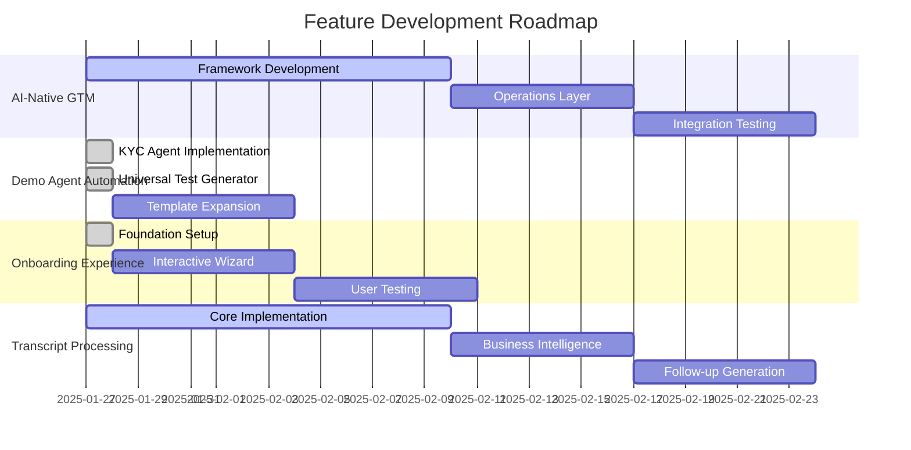
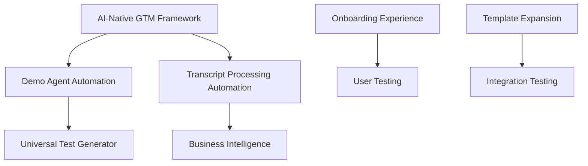

# Feature Roadmap | Generated: 2025-01-27T23:00:00Z

## 🎯 Current Sprint (Week 4)
### Active This Week
- ✅ AI-Native GTM Framework (Day 1/14) - 15% complete
- ✅ Demo Agent Automation (Day 1/7) - 25% complete  
- ✅ Onboarding Experience (Day 1/7) - 25% complete
- ✅ Transcript Processing Automation (Day 1/14) - 15% complete

## 📅 Timeline

## 🔗 Dependencies

## 📊 Risk Assessment
### 🟢 Healthy Features
- **Demo Agent Automation**: 25% complete, clear progress, recent updates
- **Onboarding Experience**: 25% complete, foundation established

### 🟡 At Risk Features
- **AI-Native GTM Framework**: 15% complete, early stage, needs acceleration
- **Transcript Processing Automation**: 15% complete, early stage, needs acceleration

## 📈 Velocity Metrics
- Features completed this week: 2 (KYC Agent Implementation, Universal Test Generator)
- Average completion time: 3.5 days
- Projected completion: 2025-02-17
- Completion rate: 25%

## 🎯 Next Actions
1. **AI-Native GTM Framework**: Complete operations layer development
2. **Demo Agent Automation**: Expand template library beyond KYC
3. **Onboarding Experience**: Implement interactive wizard
4. **Transcript Processing**: Complete core implementation

## 📋 Sprint Goals
- Complete 2 features to 50% progress
- Establish integration patterns between features
- Begin user testing for onboarding experience
- Expand demo agent automation capabilities
