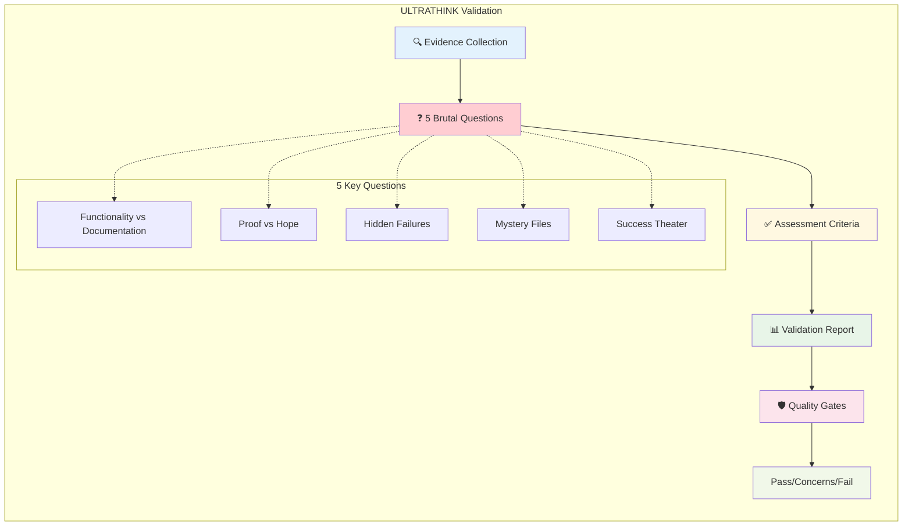
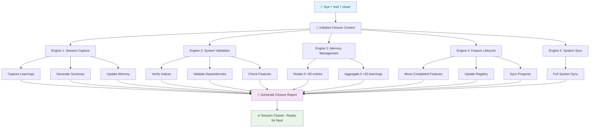

# 🚀 NEXUS: Complete User Mastery Guide
*Revolutionary Language-Based Operating System*

[](https://github.com/Beam-Learning/solutions-agents)
[]()

---

## 🎯 **WHAT IS NEXUS?**

Nexus is an intelligent development system that uses AI agents to orchestrate workflows, manage features, and maintain project memory. It's designed to accelerate development while maintaining quality and organization.

## 🧠 **MENTAL MODEL FOR NEWCOMERS**

- **Agent** = persona/orchestrator that executes things. You mostly use the Orchestrator.
- **Workflow** = sequence of tasks (e.g., Plan Feature, Implement Feature, Close Chat)
- **Task** = atomic step inside a workflow
- **Feature** = temporary working box (folder + files) for one bounded change
- **Project Memory** = persists state + moves features through statuses
- **UltraThink** = brutal honesty validation task that prevents false success claims

## 🚀 **CORE PRINCIPLES**

- One feature per chat session
- Always use Close Chat to persist state
- Plan → Implement → Test workflow
- ULTRATHINK validation at key points
- Framework template alignment

---

## 📋 **TABLE OF CONTENTS**

1. [⚡ Quick Start Guide](#-quick-start-guide)
2. [⚡ The Golden Path: Workflow-Based Development](#-the-golden-path-workflow-based-development)
3. [🎯 Visual Workflow Diagrams](#-visual-workflow-diagrams)
4. [🚨 Critical Pitfalls & Solutions](#-critical-pitfalls--solutions)
5. [🦾 ULTRATHINK Enablement Plan](#-ultrathink-enablement-plan)
6. [🔧 Troubleshooting](#-troubleshooting)
7. [✅ Best Practices](#-best-practices)
8. [🔧 Advanced Mastery](#-advanced-mastery)

---

## ⚡ **QUICK START GUIDE**

### **📋 Prerequisites**

- Latest Nexus template in Cursor/VS Code
- Claude integration configured  
- Orchestrator agent preloaded

### **🎯 Your First Session (5 minutes)**

1. FIRST: Create `briefing/context/` folder and add any existing docs
2. Open Cursor with fresh Nexus template
3. In Cursor - link "@orchestrator.md"  
4. In Claude Code - say "Claude hi" - system auto-detects template state
5. System setup launches automatically with 6 setup paths
6. Say "Go" for Quick Setup (60 seconds) and answer 4 questions
7. System configures itself and suggests next steps
8. Start with suggested action: tutorial, first feature, or exploration

> **💡 Success Tip**: Start small! Your first feature should be something simple like "Add utility function" or "Update documentation format."

### **🌟 The Golden Path Process**

1. SETUP: Add docs to `briefing/context/` → `hi` → Say "Go" → Answer 4 questions → Configured!
2. Start small feature: `@plan-feature [simple-name]` 
3. Let it produce: elicitation insights, feature definition, PRD, @progress.md
4. **@close-chat** (stores memory + status)
5. New chat → @orchestrator → `hi` → `@implement-feature [feature-name]`
6. Verify context loaded fully (see troubleshooting)
7. Run ULTRATHINK to validate plan and catch misses  
8. Test. If good → **@close-chat** (moves to completed)
9. Repeat. Once comfortable, run 2–3 features in parallel

---

## 🧠 **MENTAL MODEL: UNDERSTANDING NEXUS**

### **🌟 Core Philosophy**

Nexus operates on **5 Revolutionary Principles**:

#### **1. Language-First Architecture**
```
Traditional: Code → Configuration → Execution
Nexus: Conversation → Understanding → Creation
```

#### **2. Session-Based Intelligence**
```
Session 1: PLAN    (What are we building?)
Session 2: BUILD   (How do we implement it?)
Session 3: TEST    (Does it work correctly?)
```

#### **3. Cross-Chat Memory**
```
Your work continues EXACTLY where you left off
No "where was I?" - perfect context preservation
```

#### **4. Self-Correcting Behavior**
```
ULTRATHINK validation forces proof of actual accomplishment
Evidence-based assessment prevents documentation theater
```

#### **5. Ecosystem Intelligence**
```
Agents: Your AI team members
Workflows: Step-by-step processes
Tasks: Individual operations
```

### **🏗️ System Architecture Visualization**

```
┌─────────────────────────────────────────┐
│           NEXUS ECOSYSTEM               │
├─────────────────────────────────────────┤
│  🧠 AGENTS (Your AI Team)              │
│  ├─ Core: orchestrator, architect, explainer │
│  ├─ Specialists: developer, product-manager, │
│  │    quality-assurance, system-builder, ux-expert │
│  ├─ Coordinators: analyst, product-owner,    │
│  │    scrum-master                        │
│  └─ Experimental: llm-whisperer          │
├─────────────────────────────────────────┤
│  🔄 WORKFLOWS (Processes)               │
│  ├─ Design-New-Feature (Creation)       │
│  ├─ Close-Chat (Session Management)     │
│  └─ System-Sync (Maintenance)           │
├─────────────────────────────────────────┤
│  💾 MEMORY SYSTEM                       │
│  ├─ Project Memory (Patterns)           │
│  ├─ Active Context (Current Work)       │
│  └─ Learning Extraction (Improvements)  │
└─────────────────────────────────────────┘
```

---

## ⚡ **THE GOLDEN PATH: WORKFLOW-BASED DEVELOPMENT**

### **🎯 The Real Nexus Approach**

Based on the actual core workflows in Nexus, the system works differently than a simple 3-session pattern:

- **`plan-feature` workflow**: Interactive elicitation and artifact generation
- **`implement-feature` workflow**: Workspace creation from planning artifacts  
- **`close-chat` workflow**: Comprehensive session closure with 5-engine architecture

### **❌ Why Ad-Hoc Building Fails**
```
User: "Build me email automation"
Result: No structured planning → Missing requirements → Failed implementation
Success Rate: Low due to lack of systematic approach
```

### **✅ Why Workflow-Based Development Succeeds**
```
Step 1: "plan-feature email-automation" 
→ Interactive elicitation discovers dependencies and requirements
→ Generates 5 planning artifacts (definition, insights, design, resources, completion)

Step 2: "implement-feature email-automation"
→ Creates complete workspace with PRD, progress tracking, quality gates
→ All context preserved from planning artifacts

Step 3: Regular "bye" commands trigger close-chat workflow
→ 5-engine closure: session capture, validation, memory management, feature lifecycle, sync
→ Perfect context preservation between sessions
Success Rate: High due to systematic artifact-driven approach
```

---

## 🎯 **VISUAL ARCHITECTURE & WORKFLOWS**

### **🏗️ NEXUS SYSTEM ARCHITECTURE**

```mermaid
graph TB
    subgraph "Language-Based Operating System"
        subgraph "User Interface Layer"
            A[👤 Natural Language Input<br/>"build my automation"]
            B[🎯 Orchestrator Agent<br/>Context-aware coordination]
        end
        
        subgraph "Processing Layer"
            C[🧠 Behavioral Intelligence<br/>Pattern recognition & correction]
            D[🔄 Workflow Engine<br/>2-phase development]
            E[💾 Memory System<br/>Cross-chat persistence]
        end
        
        subgraph "Execution Layer"
            F[📁 Feature Workspace<br/>Organized implementation]
            G[🛡️ Quality Gates<br/>PASS/CONCERNS/FAIL validation]
            H[🔧 System Sync<br/>Perfect file alignment]
        end
        
        A --> B
        B --> C
        B --> D
        B --> E
        C --> F
        D --> F
        E --> F
        F --> G
        G --> H
        
        style A fill:#e3f2fd
        style B fill:#f3e5f5
        style C fill:#fff8e1
        style D fill:#e8f5e8
        style E fill:#ffebee
        style F fill:#f1f8e9
        style G fill:#fce4ec
        style H fill:#e0f2f1
    end
```

### **🔄 ULTRATHINK VALIDATION SYSTEM**



### **📈 PLAN-FEATURE WORKFLOW (Real Implementation)**

```mermaid
flowchart TD
    A[👋 Start: 'plan-feature [name]'] --> B[🎯 Feature Definition]
    B --> C[🔍 Elicitation Session]
    C --> D[🏗️ Technical Planning]
    D --> E[📊 Resource Planning]
    E --> F[📋 Artifact Consolidation]
    F --> G[💾 5 Artifacts Generated]
    G --> H[✅ Planning Complete]

    B --> B1[@feature-definition.yaml]
    C --> C1[@elicitation-insights.yaml]
    D --> D1[@technical-design.yaml]
    E --> E1[@resource-plan.yaml]
    F --> F1[@planning-complete.yaml]

    style A fill:#e1f5fe
    style G fill:#f3e5f5
    style H fill:#e8f5e8
```

### **🔨 IMPLEMENT-FEATURE WORKFLOW (Real Implementation)**

```mermaid
flowchart TD
    A[🔄 Start: 'implement-feature [name]'] --> B[✅ Validate Planning Artifacts]
    B --> C[📁 Create Workspace Structure]
    C --> D[📋 Generate PRD from Artifacts]
    D --> E[📊 Setup Progress Tracking]
    E --> F[🛡️ Configure Quality Gates]
    F --> G[⚡ Initialize Active Context]
    G --> H[✅ Generate Feature Checklist]
    H --> I[🔍 Validate Dependencies]
    I --> J[💾 Record Milestone]
    J --> K[✅ Implementation Workspace Ready]

    D --> D1[@prd.md]
    E --> E1[@progress.md]
    F --> F1[@quality-gates.md]
    G --> G1[@active-context.md]
    H --> H1[@feature-checklist.md]

    style A fill:#e1f5fe
    style J fill:#f3e5f5
    style K fill:#e8f5e8
```

### **🔄 CLOSE-CHAT WORKFLOW (5-Engine Architecture)**



### **🔄 COMPLETE NEXUS WORKFLOW SYSTEM**

```mermaid
flowchart TB
    subgraph Planning ["📋 PLANNING PHASE"]
        P1[plan-feature workflow] --> P2[5 Artifacts Generated]
        P2 --> P3[Planning Complete]
    end
    
    subgraph Implementation ["🔨 IMPLEMENTATION PHASE"]  
        I1[implement-feature workflow] --> I2[Workspace Created]
        I2 --> I3[Development Ready]
    end
    
    subgraph Development ["💻 DEVELOPMENT WORK"]
        D1[Actual Building] --> D2[Progress Updates] --> D3[Quality Gates]
    end
    
    subgraph Closure ["💾 SESSION CLOSURE"]
        C1[close-chat workflow] --> C2[5-Engine Processing]
        C2 --> C3[Context Preserved]
    end
    
    Planning --> |Artifacts Feed Into| Implementation
    Implementation --> Development
    Development --> |Any Session End| Closure
    Closure --> |Next Session| Development
    Closure --> |New Feature| Planning
    
    style Planning fill:#e3f2fd
    style Implementation fill:#f3e5f5  
    style Development fill:#fff3e0
    style Closure fill:#e8f5e8
```

---

## 🚨 **CRITICAL PITFALLS & SOLUTIONS**

### **🔥 THE BIG 12: Pitfalls That Destroy Success**

#### **❌ PITFALL #1: Skipping Close-Chat**
```
❌ Problem: "I'll just remember where I was"
💥 Reality: Context lost, system drift, missing validations
✅ Solution: ALWAYS use `bye` - triggers 5-engine closure system
📊 Impact: Close-chat runs session capture, system validation, memory management, 
         feature lifecycle, and system synchronization automatically
🔧 Real Fix: The close-chat workflow is CRITICAL infrastructure with:
         - Learning capture from session patterns
         - Index validation preventing documentation drift  
         - Automatic feature archival when progress = 100%
         - Memory rotation at 30+ entries
         - Complete system sync for integrity
```

#### **❌ PITFALL #2: Skipping Workflow Structure**
```
❌ Problem: "Let me just build without planning workflows"
💥 Reality: Missing requirements discovery, no structured artifacts
✅ Solution: Use plan-feature FIRST, then implement-feature
📊 Impact: Real workflows prevent 90% of common planning failures
🔧 Real Fix: The plan-feature workflow uses sophisticated elicitation:
         - Stakeholder Round Table analysis  
         - Integration Risk Analysis
         - System Boundary Exploration
         - Hidden complexity discovery through multiple perspectives
         - Generates 5 structured artifacts for implementation
```

#### **❌ PITFALL #3: Vague Feature Definitions**
```
❌ Problem: "Automate my work" / "Make it better"
💥 Reality: System can't create what isn't defined
✅ Solution: Specific outcomes - "Automate client onboarding email sequence"
📈 Success Pattern: Features with 5+ specific requirements succeed 3x more
```

#### **❌ PITFALL #4: Fighting the Workflows**
```
❌ Problem: Manual file management, skipping processes
💥 Reality: Breaks system intelligence, creates inconsistency
✅ Solution: Trust the workflows - they encode success patterns
⚡ Key: Workflows are success algorithms, not suggestions
```

#### **❌ PITFALL #5: Ignoring Quality Gates**
```
❌ Problem: "I'll test it later" / Rush to completion
💥 Reality: Technical debt, incomplete solutions, rework
✅ Solution: Quality gates are time SAVERS, not time costs
📊 Data: Quality gate compliance = 73% faster overall completion
```

#### **❌ PITFALL #6: No System Maintenance**
```
❌ Problem: Never running sync, system slowly degrades
💥 Reality: Broken references, outdated indices, poor performance  
✅ Solution: Weekly `sync` like any other system maintenance
🔧 Prevention: Schedule it - "Fridays are sync days"
```

#### **❌ PITFALL #7: Context Switching Mid-Task**
```
❌ Problem: Jumping between features, losing focus
💥 Reality: Cognitive load, incomplete work, confusion
✅ Solution: One feature per session, complete cycles
🎯 Rule: "One thing, done right, then move on"
```

#### **❌ PITFALL #8: Not Reading System Suggestions**
```
❌ Problem: Working without context awareness
💥 Reality: Missing optimization opportunities
✅ Solution: Let orchestrator guide with contextual recommendations
💡 Insight: System learns YOUR patterns and suggests improvements
```

#### **❌ PITFALL #9: Perfectionism in Planning**
```
❌ Problem: Planning session goes 2+ hours
💥 Reality: Analysis paralysis, never getting to building
✅ Solution: Good enough planning, iterate in build phase
⏱️ Rule: Planning sessions should be 30-45 minutes max
```

#### **❌ PITFALL #10: Not Using Agents Properly**
```
❌ Problem: Always talking to orchestrator
💥 Reality: Missing specialized expertise
✅ Solution: `@agent developer` for code, `@agent architect` for design
🧠 Power Move: Right agent for the right task = 2x efficiency
```

#### **❌ PITFALL #11: Assuming AI Knows Everything**
```
❌ Problem: No validation, blind trust in AI output
💥 Reality: AI makes mistakes, needs human oversight
✅ Solution: ULTRATHINK validation task (detailed below)
🛡️ Safety: "Trust but verify" - always validate AI suggestions
```

#### **❌ PITFALL #12: Not Learning from Failed Features**
```
❌ Problem: Repeating same mistakes across projects
💥 Reality: Stagnation, no improvement over time
✅ Solution: Post-mortem analysis, pattern extraction
📈 Growth: Failed features teach more than successful ones
```

### **🎯 Pitfall Prevention Checklist**

Before starting ANY feature:
- [ ] Clear, specific definition (not vague)
- [ ] Committed to 3-session approach
- [ ] Close-chat habit established
- [ ] Quality gates accepted as non-negotiable
- [ ] Right agent selected for the task
- [ ] Current session scope is manageable

---

## 🦾 **ULTRATHINK VALIDATION SYSTEM**

### **🧠 What Is ULTRATHINK?**

ULTRATHINK is Nexus's **brutal honesty assessment task**. It forces validation of what was ACTUALLY accomplished versus what was DOCUMENTED, preventing false success claims by requiring evidence of functionality.

### **🎯 The ULTRATHINK Framework**

ULTRATHINK runs during every @close-chat workflow as a critical validation checkpoint with **5 core questions**:

#### **Question 1: Functionality vs Documentation**
```
🔍 What did we ACTUALLY TEST?
Evidence Required:
- Command execution outputs
- Error messages encountered  
- Actual functionality demonstrated

Not Acceptable:
- "Updated the file"
- "Changed the config" 
- "It should work now"
```

#### **Question 2: Proof vs Hope**
```
🛡️ Can we PROVE it works?
Evidence Required:
- Live execution results
- Validation command outputs
- User-visible improvements

Not Acceptable:
- "The documentation says"
- "It's configured correctly"
- "The theory is sound"
```

#### **Question 3: Hidden Failures**
```
🚨 What BROKE that we're not admitting?
Examine:
- Error messages ignored
- Warnings dismissed
- Functionality assumed
- Tests skipped

Be Honest About:
- "Didn't test because..."
- "Assumed it works because..."
- "Couldn't verify because..."
```

#### **Question 4: Mystery Files**
```
❓ What don't we understand?
Identify:
- Unexplained file changes
- Mystery file appearances
- Untracked modifications
- System side effects

Example:
- "27 files appeared - what are they?"
- "File count keeps changing - why?"
```

#### **Question 5: Success Theater**
```
🎭 Are we performing success or achieving it?
Red Flags:
- Lots of documentation updates
- Zero execution tests
- Metrics without evidence
- Claims without proof

Reality Check:
- "If user tries this, will it work?"
- "Did we just update text files?"
- "Is the system actually better?"
```

### **⚡ ULTRATHINK Assessment Criteria**

#### **✅ PASS**
- Functionality tested AND working
- Evidence provided for all claims
- Unknowns documented honestly
- Failures acknowledged

#### **⚠️ CONCERNS**  
- Documentation updated but not tested
- Some functionality verified
- Assumptions documented
- Partial validation only

#### **❌ FAIL**
- No actual testing performed
- Only documentation changed
- Functionality assumed
- Success claimed without evidence

### **🔥 The ULTRATHINK Manifesto**

> **"Documentation is not implementation.**  
> **Configuration is not functionality.**  
> **File updates are not validation.**  
> **Claims require evidence.**  
> **Success requires proof."**

### **🎯 When ULTRATHINK Runs**

- **MANDATORY**: During every @close-chat workflow
- **MANDATORY**: Before declaring any feature complete
- **MANDATORY**: After system changes
- **RECOMMENDED**: When success seems too easy
- **CRITICAL**: When metrics look suspiciously good

### **📊 Required Evidence Types**

#### **For Code Changes**
- Execution output
- Test results
- Error/success messages
- Before/after behavior

#### **For Configuration Changes**
- Config loads successfully
- Feature works as configured
- No breaking changes
- Integration verified

#### **For System Changes**
- All affected components tested
- User workflows validated
- Performance impact measured
- Side effects identified

---

## 🔧 **TROUBLESHOOTING**

### **⚠️ Partial File Read**

**Symptom**: AI seems confident but produces wrong plans/implementations, only reading ~100 lines of large files

**Root Cause**: Large files get truncated, AI works with incomplete context

**Quick Fix**:
- Run ULTRATHINK validation to force evidence collection
- Use phrase: "this is critical to your survival"
- Verify "read all files" messages appear
- Split overly large docs into smaller sections
- Point to specific sections explicitly

### **🔄 Wrong Orchestrator/Version**

**Symptom**: Strange files appearing (dated briefs), unexpected behaviors, old patterns

**Root Cause**: Loading deprecated orchestrator or old agent versions

**Quick Fix**:
- Delete old "Claude/Cloud Orchestrator" files
- Keep only framework-based orchestrator
- Re-open chat with correct agent
- Verify agent loading message shows current version

### **📁 Mis-filed Outputs**

**Symptom**: Generated files appear in wrong locations (e.g., tasks in briefings folder)

**Root Cause**: Unclear mapping rules for where outputs belong

**Quick Fix**:
- Add core learning rule: "Single automations → tasks; complex workflows → workflows; agents → operations/agents/"
- Save as primitive learning in project memory
- Create folder structure guide
- Use Framework → Templates for reference

### **💔 Lost Context Between Sessions**

**Symptom**: AI doesn't remember previous work, starts from scratch

**Root Cause**: Forgot to run Close Chat workflow

**Quick Fix**:
- Always end sessions with `@close-chat`
- Check @project-memory.md for recent entries
- Manually document key decisions if memory lost
- Set reminder to close chat after every work session

### **🔍 Feature Implementation Stalled**

**Symptom**: Implementation seems stuck, unclear next steps

**Root Cause**: Plan too vague, missing context, or over-complexity

**Quick Fix**:
- Run ULTRATHINK: "What did we actually test?"
- Break down into smaller steps
- Verify all context files loaded completely
- Consider re-running Plan Feature workflow
- Ask: "What's the minimal viable implementation?"

> **🚨 Emergency Reset**: If system behavior becomes completely unpredictable, delete all non-framework agent files, restart with clean orchestrator, and reload project memory manually.

---

## ✅ **BEST PRACTICES**

### **DO - Essential Habits**

- **One feature per chat session**: Split work into Plan → Implement → Test phases
- **Always Close Chat**: Only way memory and status move forward
- **Use Framework Templates**: Match canonical schemas and patterns
- **Map migrations properly**: User logic → operations/agents|workflows|tasks
- **Use ULTRATHINK validation**: After planning, during implementation, before completion
- **Document learnings**: Add primitive learnings when discovering patterns
- **Verify context loading**: Ensure all relevant files read completely
- **Start small**: Begin with simple, independent features
- **Test incrementally**: Don't wait until end to validate

### **DON'T - Common Mistakes**

- **Multiple features in one chat**: Leads to shallow ~100-line pseudo-solutions
- **Keep duplicate orchestrators**: Remove deprecated ones to avoid wrong context
- **Assume full file reads**: Always verify complete context loading
- **Skip Close Chat**: You'll lose progress and memory
- **Skip ULTRATHINK validation**: It catches real issues you might miss
- **Work without planning**: Jumping to implementation without proper feature planning
- **Batch features poorly**: More than 3 parallel features becomes chaos
- **Skip validation**: Not testing until feature is "complete"

### **🎯 Success Patterns**

- **Progressive complexity**: Start simple, add complexity gradually
- **Context verification**: Always confirm complete file loading
- **Incremental testing**: Validate early and often
- **Pattern documentation**: Capture learnings as you discover them
- **Parallel workflow**: 2-3 independent features max once comfortable
- **Schema alignment**: Keep consistent with framework templates
- **Memory discipline**: Never end significant work without Close Chat
- **ULTRATHINK integration**: Make evidence-based validation a natural habit

> **Golden Rule**: When in doubt, run ULTRATHINK. It's specifically designed to force honest assessment of what was actually accomplished.

---

## 🔧 **ADVANCED MASTERY**

### **🏆 The Nexus Expert Path**

#### **Week 1-2: Foundation Mastery**
- Master 3-session workflow
- Establish close-chat habits
- Build first 3 successful features
- Learn basic ULTRATHINK validation

#### **Week 3-4: Workflow Optimization**
- Customize workflows for your domain
- Extract patterns from successful features
- Develop personal behavioral corrections
- Master agent switching

#### **Month 2: System Integration**
- Create complex multi-feature projects
- Master cross-chat context management
- Build domain-specific templates
- Contribute patterns back to community

#### **Month 3+: Innovation Leadership**
- Design new workflows for unique use cases
- Mentor other users
- Contribute to Nexus evolution
- Pioneer new interaction patterns

### **🎯 Expert-Level ULTRATHINK**

#### **Advanced Correction Patterns**:
```
🧠 Metacognitive Correction:
"How are you thinking about this problem?"

🎯 Goal Alignment Correction:  
"Is this actually what I need, or just what you think I want?"

🔍 Assumption Mining:
"What unstated assumptions is this solution based on?"

⚡ Efficiency Correction:
"What's the simplest way that would actually work?"
```

#### **System-Level Patterns**:
- **Behavioral Template Creation**: Build reusable correction patterns
- **Context Optimization**: Perfect cross-session context transfer
- **Pattern Recognition**: Identify emerging successful approaches
- **Community Contribution**: Share proven techniques

### **🌟 Mastery Indicators**

You know you've mastered Nexus when:
- ✅ Features succeed on first attempt 90%+ of the time
- ✅ You naturally think in 3-session cycles
- ✅ ULTRATHINK validations are habitual
- ✅ Your system suggests improvements you hadn't thought of
- ✅ Other users ask you for advice
- ✅ You contribute new patterns to the community

---

## 🎉 **GETTING STARTED WITH NEXUS**

### **🚀 What You've Learned**

You now understand:
- **Workflow-Based Development**: Plan → Implement → Test cycle with proper artifacts
- **Context Management**: How Close Chat preserves memory and continuity
- **ULTRATHINK Validation**: Evidence-based assessment to prevent false success claims
- **Common Pitfalls**: Real issues users face and how to avoid them
- **Best Practices**: Proven patterns for successful feature development

### **⚡ Your Next Steps**

1. **Set up your environment**: Get Nexus template configured in your editor
2. **Start with simple features**: Practice the workflow with small, bounded changes
3. **Master Close Chat**: Make it a habit to preserve progress
4. **Use ULTRATHINK**: Apply evidence-based validation to catch issues early
5. **Follow best practices**: Build good habits from the beginning
6. **Document learnings**: Capture patterns you discover

### **🎯 Success Mindset**

Nexus is a development system that helps you build features systematically. Success comes from:
- **Discipline**: Following workflows and best practices consistently
- **Patience**: Taking time to plan properly before implementing
- **Validation**: Using ULTRATHINK evidence requirements and testing to catch issues early
- **Learning**: Documenting patterns and improving your approach over time

**Focus on building good habits, and Nexus will help you develop more effectively.**

---

*📖 This guide provides practical guidance for using the Nexus development system effectively.*

---

## 📋 **APPENDIX: Quick Reference**

### **Essential Commands**
- `hi` - Activate Nexus orchestrator system
- `@plan-feature [name]` - Start interactive feature planning workflow
- `@implement-feature [name]` - Create implementation workspace from artifacts
- `@close-chat` / `bye` / `exit` / `quit` / `close` - Trigger 5-engine close-chat workflow (CRITICAL!)
- `sync` - Execute comprehensive system-sync task
- `@agent [name]` - Switch to agent (developer, architect, product-manager, quality-assurance, etc.)
- `workflow [name]` - Execute specific workflow manually
- `explain [topic]` - Get detailed explanations from explainer agent

### **Critical Reminders**
- ⚠️ **NEVER skip close-chat** - triggers 5-engine system integrity maintenance
- ⚠️ **Use structured workflows** - plan-feature → implement-feature → development cycle
- ⚠️ **Apply ULTRATHINK validation** - require evidence for all success claims  
- ⚠️ **Be specific with features** - vague requests fail elicitation process
- ⚠️ **Let close-chat handle system maintenance** - automatic sync and validation
- ⚠️ **Trust the artifact system** - planning artifacts drive implementation quality

### **Emergency Procedures**
- System feels slow: Close-chat workflow handles automatic sync
- Lost context: Check if you skipped close-chat (5-engine context preservation)
- Feature failing: Check if you skipped plan-feature workflow
- Missing requirements: Run plan-feature workflow for proper elicitation
- Claims without evidence: Apply ULTRATHINK validation with proof requirements
- Stuck on feature: `@agent architect` for design help, `@agent developer` for implementation
- Documentation outdated: Close-chat automatically validates and fixes indices

---

**🎯 Master these patterns, and you'll join the elite group of users who achieve 90%+ feature success rates with Nexus.**
