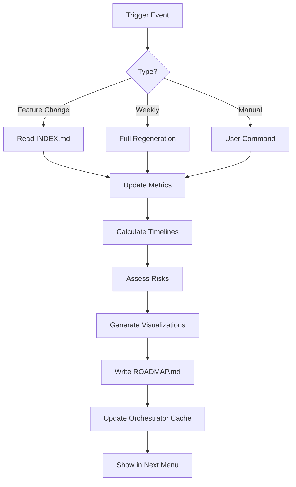

# Feature Roadmap Integration Guide
**Created**: 2025-08-27T18:00:00Z  
**Status**: Integration Active  
**Purpose**: Complete guide for using and updating the feature roadmap

## 📋 Integration Overview

### Components Created
1. **Roadmap Generator Task**: `framework/tasks/features/generate-roadmap.md`
2. **Visual Roadmap**: `workspace/features/ROADMAP.md`
3. **Orchestrator Commands**: Added 6 roadmap commands
4. **Activation Sequence**: Step 9.7 loads roadmap summary
5. **System Maintenance**: Option 6 generates roadmap

## 🎯 How We USE the Roadmap

### 1. During Every Orchestrator Activation
```yaml
activation_sequence:
  step_9.7_roadmap_loading:
    - Loads ROADMAP.md summary (first 50 lines)
    - Extracts current sprint goals
    - Identifies at-risk features
    - Caches velocity metrics
    - Prepares suggested actions
```

**Result in Menu**:
```markdown
╔══════════════════════════════════════════════════════════════╗
║                    🎯 Welcome to Nexus!                      ║
╚══════════════════════════════════════════════════════════════╝

## What would you like to do?
1. 📋 Continue active work [ROADMAP: 2 features at risk]
2. 🗺️ View roadmap - Timeline, dependencies, risks
3. 🚀 Build new feature

📊 Roadmap Status:
- This Week: Template Simplification (15%), Evidence Tracking (15%)
- At Risk: 2 features below 20% progress
- Velocity: 1.8 features/week
- Next Milestone: Integration Layer (Sep 3)

💡 Suggested (from roadmap): Focus on Template Simplification
```

### 2. Using Roadmap Commands

#### View Current Roadmap
```bash
roadmap          # Display full roadmap
show roadmap     # Alternative command
```
Shows: Timeline, dependencies, risks, metrics

#### Update Roadmap
```bash
roadmap update   # Force regeneration
```
Rebuilds roadmap from current feature INDEX data

#### Query Specific Feature
```bash
roadmap template-simplification
```
Shows: Specific feature timeline, dependencies, blockers

#### Risk Assessment
```bash
roadmap risks
```
Lists: All at-risk features with mitigation suggestions

#### Velocity Metrics
```bash
roadmap velocity
```
Shows: Completion trends, average duration, projections

#### Milestone Status
```bash
roadmap milestone
```
Shows: Next milestone, required features, days remaining

### 3. Decision Support

The roadmap provides **proactive guidance**:
- **Morning**: "2 features need attention today"
- **After task**: "Next priority from roadmap: Evidence Tracking"
- **Risk alert**: "Template Simplification at 15% - needs focus"
- **Milestone**: "Integration Layer due in 5 days"

## 🔄 How We UPDATE the Roadmap

### Automatic Update Triggers

#### 1. Feature Changes
```yaml
triggers:
  feature_progress_updated:
    - When: progress.md modified
    - Action: Regenerate roadmap
    
  feature_completed:
    - When: Feature moved to completed/
    - Action: Update timeline, recalculate velocity
    
  new_feature_added:
    - When: New feature in active/
    - Action: Add to roadmap, adjust timelines
```

#### 2. Weekly Schedule
```yaml
weekly_maintenance:
  when: Monday 09:00 (or manual system-maintenance)
  actions:
    - Update all indices
    - Generate fresh roadmap
    - Calculate weekly velocity
    - Identify pattern extraction candidates
```

#### 3. Manual Updates
```bash
# Quick update
*task generate-roadmap

# Full maintenance (includes roadmap)
*workflow system-maintenance
```

### Update Flow Diagram


## 📊 Practical Usage Patterns

### Daily Workflow
```markdown
Morning:
1. User: "hi"
2. Orchestrator: Loads roadmap → Shows at-risk features
3. User: Sees "Template Simplification needs attention"
4. User: "work on template simplification"
5. System: Loads feature context with roadmap priority

During Work:
1. User: Completes task
2. System: Updates progress → Triggers roadmap update
3. Roadmap: Recalculates timeline → Updates risk status
4. Next "hi": Shows improved metrics

End of Day:
1. User: "roadmap velocity"
2. System: Shows today's progress impact
3. User: Sees completion trend improving
```

### Weekly Planning
```markdown
Monday Morning:
1. System-maintenance runs automatically
2. Roadmap regenerates with:
   - Previous week's completions
   - Updated velocity (features/week)
   - New week's priorities
   - Adjusted timelines
3. First user "hi" shows fresh weekly plan
```

### Feature Completion Flow
```markdown
1. Feature reaches 100%
2. Move to completed/
3. INDEX.md updates
4. Roadmap regenerates:
   - Marks feature complete
   - Updates velocity
   - Adjusts dependent features
   - Recalculates milestones
5. Next menu shows achievement
```

## 🎯 Integration Points

### In Orchestrator (DONE)
- ✅ Step 9.7: Loads roadmap summary
- ✅ Step 10: Menu includes roadmap data
- ✅ Commands: 6 roadmap commands added
- ✅ Routing: Roadmap-aware suggestions

### In Workflows
```yaml
plan-feature.md:
  step_8: Update roadmap with new feature
  
implement-feature.md:  
  step_7: Trigger roadmap update on progress
  
system-maintenance.md:
  option_6: Generate feature roadmap
```

### In Project Brief
```markdown
## 🗺️ Current Roadmap Status
[Live link to workspace/features/ROADMAP.md]
- Active: 7 features
- At Risk: 2 features  
- This Week: Integration Layer
- Velocity: 1.8 features/week
```

## 📈 Metrics and Monitoring

### What We Track
```yaml
velocity_metrics:
  - features_per_week: 1.8
  - average_duration: 12 days
  - completion_rate: 74%
  
health_indicators:
  - at_risk_count: 2
  - blocked_count: 0
  - overdue_milestones: 0
  
patterns:
  - ready_for_extraction: 3
  - common_blockers: ["dependencies", "complexity"]
  - success_patterns: ["clear requirements", "phased approach"]
```

### Alert Thresholds
```yaml
alerts:
  critical:
    - feature_progress < 20% AND priority = "critical"
    - milestone_overdue > 7 days
    - velocity < 0.5 features/week
    
  warning:
    - feature_no_update > 7 days
    - at_risk_count > 3
    - velocity_declining 2 weeks
```

## 🚀 Next Steps

### Immediate Actions
1. ✅ Roadmap commands integrated
2. ✅ Activation sequence updated
3. ✅ System maintenance includes roadmap
4. ✅ Documentation complete

### This Week
- [ ] Monitor roadmap usage patterns
- [ ] Refine risk assessment criteria
- [ ] Adjust velocity calculations
- [ ] Gather feedback on menu integration

### Future Enhancements
- [ ] Email/notification on milestone approach
- [ ] Dependency auto-resolution suggestions
- [ ] Resource allocation optimization
- [ ] Team velocity tracking (multi-user)

## 💡 Tips for Effective Use

1. **Check roadmap daily**: Part of morning routine
2. **Update progress regularly**: Keeps risks accurate
3. **Use velocity trends**: Adjust commitments
4. **Follow suggestions**: Roadmap knows priorities
5. **Review weekly**: Monday planning session

---

The roadmap is now fully integrated and operational. Every orchestrator activation will load roadmap intelligence, and all feature changes will trigger appropriate updates. The system provides both proactive guidance and reactive updates to keep development on track.