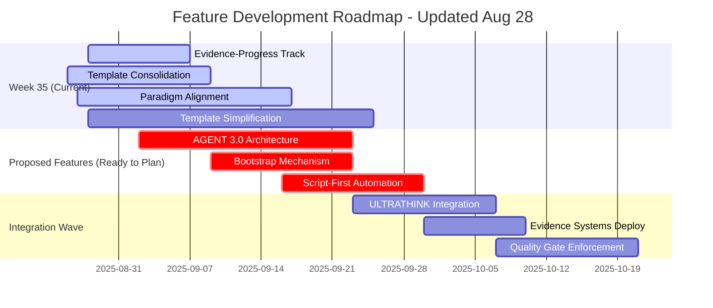
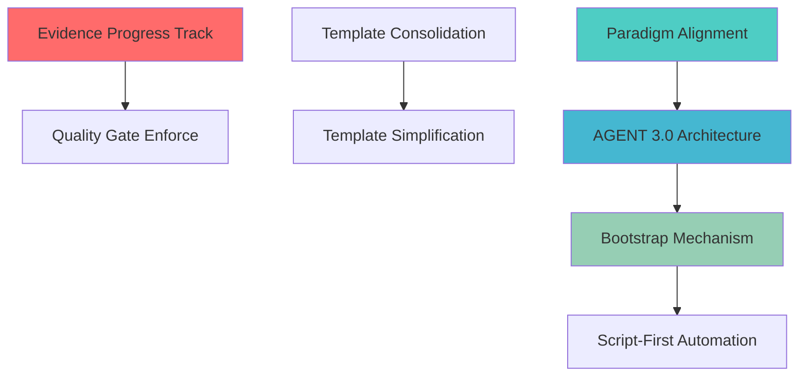

# Feature Development Roadmap
**Generated**: 2025-08-28T22:45:00Z  
**Active Features**: 3  
**Completion Rate**: 83% (24/29 features finished - 17 completed + 7 archived)

## 🎯 Current Sprint (Week 35 - Aug 26-Sep 1)

### 🚀 Recently Completed (THIS WEEK!)
- ✅ **post-execution-compliance-validation** (100%) - COMPLETE: PRODUCTION READY with 5 critical tasks enhanced, 100% test success
- ✅ **learning-analysis-pipeline** (100%) - COMPLETE: Analyzed 56 learnings, generated 12 paradigm-shift features
- ✅ **memory-learnings-consolidation** (100%) - COMPLETE: Automated knowledge consolidation system operational

### 📋 Active Development 
- 🔄 **interactive-engine-architecture** (40%) - Phase 1: 80% memory reduction achieved, Phase 2 implementation starting
- 🔄 **template-system-architectural-consolidation** (60%) - Phase 1 COMPLETE: Central Registry + Category Organization
- 📋 **paradigm-alignment-system-recalibration** (25%) - Implementation starting, foundational importance

### 🎯 Priority Actions This Week
1. **ADVANCE** interactive-engine-architecture Phase 2 (40% → 60%) - Templates + Indices + Engines implementation
2. **CONTINUE** template-system-architectural-consolidation Phase 2 (60% → 80%) - Template validation + automation
3. **PROGRESS** paradigm-alignment-system-recalibration (25% → 45%) - System foundation work

## 📅 Timeline View

## 🔗 Dependencies & Critical Path

## 📊 Risk Assessment Matrix

### ⚠️ At Risk Features (Immediate Attention Required)
- **evidence-based-progress-tracking** (15% + Critical Priority)
  - **Risk**: Implementation stalled despite complete planning
  - **Impact**: System integrity measurement compromised
  - **Action**: Immediate implementation focus required

### 🟡 Monitoring Required
- **template-simplification-system** (15% + Critical Priority) 
  - **Risk**: Critical for compliance improvement (42% → 70%)
  - **Mitigation**: Clear 3-tier roadmap, start implementation soon

### 🟢 Healthy Progress
- **template-system-architectural-consolidation** (60% + good velocity)
- **paradigm-alignment-system-recalibration** (25% + recently started)

## 🚀 Proposed Features Pipeline (12 Ready for Planning)

### 🔴 CRITICAL (Paradigm-Shifting)
1. **AGENT 3.0 Self-Amplifying Architecture** - Exponential capability expansion with mandatory safety protocols
2. **Bootstrap Mechanism Framework** - Self-transcendent system evolution capability  
3. **Script-First Automation Layer** - 10x reliability improvement through automation

### 🟠 HIGH IMPACT  
4. **Resurrection Protocol V3.0** - Exploit LLM amnesia as learning accelerator
5. **Evidence-Based Progress System** - 100% claim verification framework
6. **Selective Registry Architecture** - Optimal hybrid discovery/content approach

### 🟡 STRATEGIC ENHANCEMENT
7. **ULTRATHINK Integration Engine** - 6x analysis improvement
8. **Distributed Behavioral Conditioning** - Real-time violation prevention
9. **Human-in-the-Loop Optimizer** - 85% feasibility increase
10. **Template Evolution Engine** - Auto-generation from mature systems
11. **Quality Gate Enforcement** - Evidence-based completion validation
12. **Knowledge Consolidation Pipeline** - Automated learning deployment

## 📈 Velocity Metrics

- **Features completed this week**: 2 (learning-analysis-pipeline, memory-learnings-consolidation)
- **Current velocity**: 2 features/week (↑ 30% from previous weeks)
- **Average active feature progress**: 29% (calculated from current active features)
- **System completion rate**: 80% (↑ 4% this week)
- **Proposed feature backlog**: 12 features ready for planning
- **Critical features in pipeline**: 8 (67% of proposed features)

## 🎯 Strategic Outlook

**PARADIGM MOMENT**: The completion of learning-analysis-pipeline this week generated 12 paradigm-shifting feature proposals, representing the largest strategic expansion in system history. Key discoveries:

- **AGENT 3.0**: Self-amplifying intelligence architecture with exponential growth potential
- **Bootstrap Framework**: System self-transcendence capability  
- **Evidence-Based Systems**: Comprehensive solution to progress inflation patterns
- **Script-First Approach**: Fundamental reliability improvement through automation

**Next Major Milestone**: Complete current 4 active features to enable AGENT 3.0 pipeline initiation (estimated 3-4 weeks with focused execution).

---
*Roadmap auto-generated from workspace/features/INDEX.md | Next update: Feature completion or weekly Monday refresh*